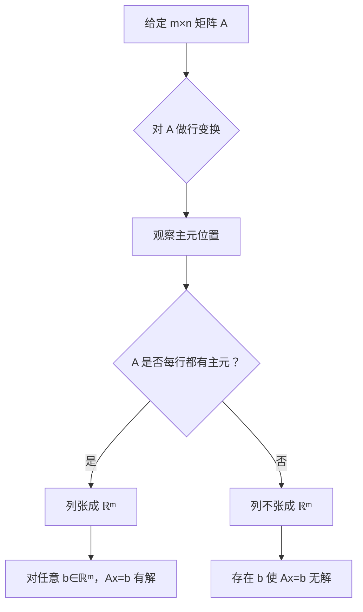

# MATH-SHU 140 线性代数  
## Lecture 1：矩阵与线性方程组（Matrix and Linear Systems）  
**授课教师**：Prof. Eric Endo  
**日期**：2026 年 1 月 19 日（星期一）  

---

## 一、核心概念定义

### 1. 矩阵（Matrix）
- **非正式定义**：一个由实数构成的矩形表格。
- **形式化定义**：设 $ m, n \in \mathbb{N} $，一个 $ m \times n $ 的实矩阵是一个函数  
  $$
  A: [m] \times [n] \to \mathbb{R}, \quad (i,j) \mapsto a_{ij}
  $$
  其中：
  - $[n] = \{1, 2, \dots, n\}$，
  - $[m] \times [n] = \{(i,j) \mid 1 \le i \le m,\ 1 \le j \le n\}$，
  - $a_{ij}$ 表示第 $i$ 行、第 $j$ 列的元素。

> **示例**：  
> $$
> A = \begin{bmatrix}
> 2 & 0 & 5 \\
> 3 & -1 & 0
> \end{bmatrix}
> \Rightarrow
> \begin{cases}
> A(1,1) = 2, \\
> A(2,3) = 0, \\
> A(1,3) = 5.
> \end{cases}
> $$

---

### 2. 向量（Vector）
向量有三种等价但视角不同的理解方式：

#### （1）列表形式（List of Numbers）
- 一个有序数组，如 $\begin{bmatrix} 1 \\ 3 \end{bmatrix}$、$\begin{bmatrix} \pi \\ 13 \\ 5 \end{bmatrix}$。
- 可视为 $m \times 1$ 的矩阵（列向量）：
  $$
  \vec{v} = \begin{bmatrix} v_1 \\ v_2 \\ \vdots \\ v_m \end{bmatrix}.
  $$

#### （2）几何对象（Geometric Object）
- 具有**长度**（模）和**方向**的箭头。
- 适用于二维/三维空间直观理解；
- 高维向量（如四维及以上）虽不可视，但数学上仍成立。

#### （3）向量空间中的元素（Element of a Vector Space）
- 更抽象的定义：属于某个满足向量空间公理的集合。
- 例子包括：
  - $\mathbb{R}^n$（坐标系），
  - 所有次数不超过 $n$ 的多项式函数集合，
  - 所有连续函数或可微函数的集合。

> **注**：此观点将在 Lecture 13 正式引入。

---

### 3. 线性代数的本质
- **线性代数是研究线性变换（Linear Transformations）的数学分支**。
- **变换（Transformation） = 函数（Function）**：将输入映射为输出。
  - 示例：
    - $f(x) = 2x$（标量函数），
    - $T\left(\begin{bmatrix} x \\ y \end{bmatrix}\right) = \begin{bmatrix} x + y \\ xy \end{bmatrix}$（非线性），
    - $D(f) = \frac{d}{dx}f(x)$（微分算子），
    - $E(f) = f(0)$（求值泛函）。

---

### 4. 线性变换（Linear Transformation）
一个变换 $T$ 是**线性的**，当且仅当对所有向量 $\vec{x}, \vec{y}$ 和标量 $a \in \mathbb{R}$ 满足：

$$
\begin{aligned}
\text{(加法保持)} &\quad T(\vec{x} + \vec{y}) = T(\vec{x}) + T(\vec{y}), \\
\text{(数乘保持)} &\quad T(a\vec{x}) = a T(\vec{x}).
\end{aligned}
$$

> **典型例子**：
> - $f(x) = 2x$：满足 $f(x+y) = f(x)+f(y)$，$f(ax)=af(x)$ ⇒ 线性。
> - 微分算子 $D(f) = f'$：$(f+g)' = f' + g'$，$(af)' = a f'$ ⇒ 线性。
>
> **非线性反例**：$T\left(\begin{bmatrix} x \\ y \end{bmatrix}\right) = \begin{bmatrix} x+y \\ xy \end{bmatrix}$，因第二分量含乘积项 $xy$。

> **预告**：Lecture 8 将系统学习线性变换；Lecture 5 学习矩阵–向量乘法。

---

## 二、矩阵与向量的运算基础

### 1. 矩阵–向量乘法（Matrix–Vector Multiplication）
*  给定 $A \in \mathbb{R}^{m \times n}$，$\vec{v} \in \mathbb{R}^n$，定义：
  $$
  A\vec{v} = \begin{bmatrix}
  a_{11} & \cdots & a_{1n} \\
  \vdots & \ddots & \vdots \\
  a_{m1} & \cdots & a_{mn}
  \end{bmatrix}
  \begin{bmatrix}
  v_1 \\ \vdots \\ v_n
  \end{bmatrix}
  =
  \begin{bmatrix}
  \sum_{j=1}^n a_{1j} v_j \\
  \vdots \\
  \sum_{j=1}^n a_{mj} v_j
  \end{bmatrix}.
  $$

> **示例**：
$$
\begin{bmatrix}
2 & 3 \\
-1 & 2
\end{bmatrix}
\begin{bmatrix}
-2 \\ 1
\end{bmatrix}
=
\begin{bmatrix}
2(-2) + 3(1) \\
(-1)(-2) + 2(1)
\end{bmatrix}
=
\begin{bmatrix}
-1 \\ 4
\end{bmatrix}.
$$

- **关键性质**：固定矩阵 $A$，映射 $\vec{v} \mapsto A\vec{v}$ 是一个**线性变换**（Lecture 8 证明）。

---

### 2. 矩阵作为几何变换的表示
特定矩阵对应经典几何操作：

| 矩阵 $A$ | 几何作用 | 说明 |
|----------|--------|------|
| $\begin{bmatrix} 2 & 0 \\ 0 & 2 \end{bmatrix}$ | 均匀缩放（放大2倍） | 所有向量长度×2 |
| $\begin{bmatrix} -1 & 0 \\ 0 & -1 \end{bmatrix}$ | 关于原点对称（反射） | $\vec{v} \mapsto -\vec{v}$ |
| $\begin{bmatrix} 0 & -1 \\ 1 & 0 \end{bmatrix}$ | 逆时针旋转90° | 保距正交变换 |
| $\begin{bmatrix} 1 & 0 \\ 0 & 0 \end{bmatrix}$ | 投影到 $x$-轴 | $y$ 分量归零 |

> **注**：这些将在 Lecture 8 结合线性变换深入探讨。

---

## 三、核心问题驱动学习

### 问题1：解的存在性（Existence of Solutions）
> 给定向量 $\vec{w}$，是否存在 $\vec{v}$ 使得 $A\vec{v} = \vec{w}$？

**等价于求解线性方程组**：

$$
\begin{bmatrix} 2 & 1 \\ 3 & -1 \end{bmatrix} \begin{bmatrix} x \\ y \end{bmatrix} =
\begin{bmatrix}
1 \\ 5
\end{bmatrix}
\quad \Longleftrightarrow \quad
\begin{cases}
2x + y = 1, \\
3x - y = 5.
\end{cases}
$$

- 此即**线性系统（Linear System）**，是本课程前半段（Lectures 1–12）的核心内容。
- 解法工具：高斯消元、行阶梯形、矩阵秩等（Lectures 2–6）。

---

### 问题2：为何要学线性代数？
线性代数是现代科学与工程的**通用语言**，应用广泛：

- **优化**：线性/整数/半定规划（Operations Research）；
- **动力系统**：寻找平衡点、稳定性分析；
- **量子力学**：可观测量 → 算子代数、C*-代数；
- **概率与金融**：马尔可夫链、鞅（Martingales）建模随机过程；
- **机器学习**：线性回归、主成分分析（PCA）、神经网络基础。

> **强调**：不仅是计算工具，更是**抽象思维与证明能力**的训练场。

---

## 四、学习建议与课程提醒（基于 Syllabus）

### 1. 课程结构
- **前12讲**：侧重计算与几何直观（线性方程组、矩阵、行列式）；
- **后16讲**：转向抽象理论（向量空间、特征值、内积、正交性）；
- **关键转折点**：Lecture 13（向量空间正式定义）。

> **忠告**：勿轻视前半学期！它是理解后半学期抽象内容的基石。

### 2. 成功策略
- ✅ **全程出勤**：讲座 + 习题课（Recitation）均强制要求；
- ✅ **主动提问**：利用 Office Hours（每周更新于 Brightspace）；
- ✅ **大量练习**：课本 + 讲义习题，尤其重视**证明题**；
- ✅ **善用资源**：
  - ARC（Academic Resource Center）提供线性代数辅导；
  - Gradescope 提交作业（入口码：`ZJJYDP`）；
  - Brightspace 获取公告、作业截止时间。

### 3. 重要政策
- **作业**：每周布置，11天后截止；迟交 ≤48h 扣20%，超时得0；
- **测验**：4次，取最低分剔除；闭卷、无电子设备；
- **期中/期末**：各占30%；覆盖 Lecture 1–12 / 13–28；
- **缺勤/缺考**：必须**提前邮件联系** `eoe2@nyu.edu`，否则记0分。

---

## 五、课堂练习（摘自 LAlec1.pdf）

### 集合与矩阵基础
1. 列出以下集合元素：
   - (a) $[10] = \{1,2,\dots,10\}$
   - (b) $[3] \times [4] = \{(i,j) \mid 1\le i\le3,\ 1\le j\le4\}$（共12个有序对）
   - (c) $[1] \times [5] = \{(1,1), (1,2), \dots, (1,5)\}$
   - (d) $[5] \times [1] = \{(1,1), (2,1), \dots, (5,1)\}$

2. $[1]\times[5] \ne [5]\times[1]$（有序对顺序不同）。

3. $|[m] \times [n]| = m \cdot n$。

### 线性方程组求解（预习）
尝试用任意方法求解：
- (a) $\begin{cases} 2x + 5y = 7 \\ x + y = 2 \end{cases}$
- (b) 三元非齐次系统
- (c) 三元齐次系统（必有零解，关注是否有非零解）
- (d) 两方程实质相同 ⇒ 无穷多解
- (e) 三方程矛盾 ⇒ 无解

> **目标**：体会“解的唯一性/存在性/无穷性”三种情形。

---

> **结语**：线性代数是“从具体到抽象”的桥梁。初期看似熟悉（解方程），后期将揭示其深刻结构（空间、基、谱）。保持耐心，勤于思考，你将掌握一门强大而优美的数学语言。

---

## Lecture 2：线性方程组（Systems of Linear Equations）  


---

## 一、线性方程（Linear Equation）

### 1. 定义  
设 $n \geq 1$，变量为 $x_1, x_2, \dots, x_n$，则一个 **线性方程**（linear equation） 是形如：

$$
a_1 x_1 + a_2 x_2 + \cdots + a_n x_n = b
$$

其中：
- 系数 $a_1, a_2, \dots, a_n$ 和常数项 $b$ 属于 $\mathbb{R}$ 或 $\mathbb{C}$（实数或复数）；
- 所有变量的次数均为 1（即无乘积项、根号、指数、三角函数作用于变量等）。

> ✅ **关键点**：必须能写成上述标准形式；若含非线性项（如 $x_1 x_2$、$\sqrt{x_2}$、$e^{x_1}$），则不是线性方程。

---

### 2. 示例分析（来自讲义 p.4–12）

| 编号 | 方程 | 是否线性？ | 理由 |
|------|------|------------|------|
| (1) | $4x_1 - 5x_2 = 1$ | ✅ 是 | 标准线性形式 |
| (2) | $5x_1 = 7$ | ✅ 是 | 单变量线性 |
| (3) | $3 + x_1 = x_2$ → $x_1 - x_2 = -3$ | ✅ 是 | 可整理为标准形式 |
| (4) | $x_1 + 2x_1 - x_2 + 3x_2 = 4$ → $3x_1 + 2x_2 = 4$ | ✅ 是 | 合并同类项后为线性 |
| (5) | $x_1 x_2 + x_3 = 0$ | ❌ 否 | 含乘积项 $x_1 x_2$ |
| (6) | $x_1 + \sqrt{x_2} = 1$ | ❌ 否 | 含非线性函数 $\sqrt{x_2}$ |
| (7) | $\frac{1}{4}x_2 + (\ln 3)x_1 - \tan\left(\frac{\pi}{5}\right)x_3 = \sqrt{36}$ | ✅ 是 | 系数为常数（$\ln 3$, $\tan(\pi/5)$, $\sqrt{36}=6$ 均为实数常量） |
| (8) | $0x_1 = 0$ | ✅ 是 | 恒成立，是退化的线性方程 |
| (9) | $0x_1 = 1$ | ✅ 是 | 虽然无解，但形式仍为线性（系数为 0，常数项为 1） |

> 📌 **重要说明**：  
> - 判断是否为线性方程 **只看形式**，与是否有解无关。  
> - 系数可以是任意实数/复数常量（包括 $\pi, e, \ln 2, \tan(\cdot)$ 等），只要不涉及变量即可。

---

## 二、线性方程组（Linear System）

### 1. 定义  
一个 **线性方程组**（system of linear equations） 是若干个**共享相同变量** $x_1, \dots, x_n$ 的线性方程的集合。

例如：
$$
\begin{cases}
2x_1 - x_2 + 32x_3 = 8 \\
x_1 - 4x_3 = -7
\end{cases}
$$

> ✅ 所有方程必须是线性的，且变量一致。

---

### 2. 解（Solution）  
一个 **解** 是一个有序数组 $(s_1, s_2, \dots, s_n)$，使得将 $x_i = s_i$ 代入每个方程后，所有等式均成立。

- **解集**（solution set）：所有解构成的集合。
- **等价系统**（equivalent systems）：两个线性系统若具有**完全相同的解集**，则称它们等价。

> 🔍 示例（p.19）：  
> $$
> \begin{cases}
> 2x_1 + x_2 = 4 \\
> x_1 + 2x_2 = -1
> \end{cases}
> \quad \text{与} \quad
> \begin{cases}
> 3x_1 + x_2 = 7 \\
> -x_1 - x_2 = -1
> \end{cases}
> $$
> 均有唯一解 $(3, -2)$，故等价。

---

### 3. 几何解释（Geometric Interpretation）  
对于两个变量的线性系统（即平面上的直线）：
- **唯一解** ↔ 两直线相交于一点；
- **无穷多解** ↔ 两直线重合；
- **无解** ↔ 两直线平行但不重合。

> 📈 一般地，每个线性方程 $a x_1 + b x_2 = c$（$b \ne 0$）可表示为直线：
> $$
> x_2 = -\frac{a}{b} x_1 + \frac{c}{b}
> $$

---

### 4. 解的存在性分类（p.24）

对任意含 $n$ 个变量的线性系统，其解的情况仅有三种可能：

| 情况 | 描述 | 术语 |
|------|------|------|
| (1) | 无解 | **不相容**（inconsistent） |
| (2) | 恰有一个解 | **相容且唯一**（consistent and unique） |
| (3) | 无穷多解 | **相容但非唯一**（consistent with infinitely many solutions） |

> ✅ **相容**（consistent）：指有解（情况 2 或 3）；  
> ❌ **不相容**（inconsistent）：指无解（情况 1）。

---

## 三、求解线性系统：矩阵方法（Matrix Notation）

### 1. 系数矩阵与增广矩阵（p.26–27）

给定系统：
$$
\begin{cases}
x_1 - 2x_2 + x_3 = 0 \\
2x_2 - 8x_3 = 8 \\
5x_1 - 5x_3 = 10
\end{cases}
$$

- **系数矩阵**（coefficient matrix）：
  $$
  \begin{bmatrix}
  1 & -2 & 1 \\
  0 & 2 & -8 \\
  5 & 0 & -5
  \end{bmatrix}
  $$

- **增广矩阵**（augmented matrix）：在系数矩阵右侧添加常数列
  $$
  \left[\begin{array}{ccc|c}
  1 & -2 & 1 & 0 \\
  0 & 2 & -8 & 8 \\
  5 & 0 & -5 & 10
  \end{array}\right]
  \quad \text{或简写为} \quad
  \begin{bmatrix}
  1 & -2 & 1 & 0 \\
  0 & 2 & -8 & 8 \\
  5 & 0 & -5 & 10
  \end{bmatrix}
  $$

---

### 2. 初等行变换（Elementary Row Operations）

用于将原系统转化为**等价但更易求解**的系统。三种基本操作：

| 操作 | 描述 | 矩阵记号示例 |
|------|------|---------------|
| (1) 行交换 | 交换两行 | $R_i \leftrightarrow R_j$ |
| (2) 数乘 | 某行乘以非零常数 $k \ne 0$ | $k R_i \to R_i$ |
| (3) 行加法 | 将某行加上另一行的倍数 | $R_i + k R_j \to R_i$（$i \ne j$） |

> ⚠️ 这些操作**保持系统等价性**（即解集不变）。

---

### 3. 高斯消元法示例（p.36–47）

目标：将增广矩阵化为**行最简形**（reduced row echelon form, RREF），即单位矩阵左侧 + 解向量右侧。

**原始系统**：
$$
\begin{cases}
x_1 - 2x_2 + x_3 = 0 \\
2x_2 - 8x_3 = 8 \\
5x_1 - 5x_3 = 10
\end{cases}
\quad \Rightarrow \quad
\begin{bmatrix}
1 & -2 & 1 & 0 \\
0 & 2 & -8 & 8 \\
5 & 0 & -5 & 10
\end{bmatrix}
$$

**步骤**（使用行操作记号）：

1. $R_3 \leftarrow R_3 - 5R_1$：
   $$
   \begin{bmatrix}
   1 & -2 & 1 & 0 \\
   0 & 2 & -8 & 8 \\
   0 & 10 & -10 & 10
   \end{bmatrix}
   $$

2. $R_2 \leftarrow \frac{1}{2} R_2$：
   $$
   \begin{bmatrix}
   1 & -2 & 1 & 0 \\
   0 & 1 & -4 & 4 \\
   0 & 10 & -10 & 10
   \end{bmatrix}
   $$

3. $R_3 \leftarrow \frac{1}{10} R_3$：
   $$
   \begin{bmatrix}
   1 & -2 & 1 & 0 \\
   0 & 1 & -4 & 4 \\
   0 & 1 & -1 & 1
   \end{bmatrix}
   $$

4. $R_3 \leftarrow R_3 - R_2$：
   $$
   \begin{bmatrix}
   1 & -2 & 1 & 0 \\
   0 & 1 & -4 & 4 \\
   0 & 0 & 3 & -3
   \end{bmatrix}
   $$

5. $R_3 \leftarrow \frac{1}{3} R_3$：
   $$
   \begin{bmatrix}
   1 & -2 & 1 & 0 \\
   0 & 1 & -4 & 4 \\
   0 & 0 & 1 & -1
   \end{bmatrix}
   $$

6. $R_2 \leftarrow R_2 + 4R_3$：
   $$
   \begin{bmatrix}
   1 & -2 & 1 & 0 \\
   0 & 1 & 0 & 0 \\
   0 & 0 & 1 & -1
   \end{bmatrix}
   $$

7. $R_1 \leftarrow R_1 - R_3$：
   $$
   \begin{bmatrix}
   1 & -2 & 0 & 1 \\
   0 & 1 & 0 & 0 \\
   0 & 0 & 1 & -1
   \end{bmatrix}
   $$

8. $R_1 \leftarrow R_1 + 2R_2$：
   $$
   \begin{bmatrix}
   1 & 0 & 0 & 1 \\
   0 & 1 & 0 & 0 \\
   0 & 0 & 1 & -1
   \end{bmatrix}
   $$

**结论**：解为 $(x_1, x_2, x_3) = (1, 0, -1)$

> ✅ **务必验证**（p.47）：代入原方程确认成立！

---

## 四、存在性与唯一性分析（Existence and Uniqueness）

### 1. 两大核心问题（p.52）
对任意线性系统：
1. **是否存在解？**（Is the system consistent?）
2. **若存在，是否唯一？**（Is the solution unique?）

---

### 2. 判别方法：通过增广矩阵的行简化

#### 案例 1：有唯一解（p.53–55）
同上例，最终得到：
$$
\begin{bmatrix}
1 & -2 & 1 & 0 \\
0 & 1 & -4 & 4 \\
0 & 0 & 1 & -1
\end{bmatrix}
\Rightarrow \text{可回代求出唯一解} \Rightarrow \text{consistent}
$$

#### 案例 2：无穷多解（p.56–58）
系统：
$$
\begin{cases}
x_1 + 4x_2 = -9 \\
-3x_1 -12x_2 = 27
\end{cases}
\Rightarrow
\begin{bmatrix}
1 & 4 & -9 \\
-3 & -12 & 27
\end{bmatrix}
\xrightarrow{R_2 + 3R_1}
\begin{bmatrix}
1 & 4 & -9 \\
0 & 0 & 0
\end{bmatrix}
$$

- 第二行对应 $0 = 0$，恒成立；
- 第一行：$x_1 = -9 - 4x_2$，$x_2$ 自由 → **无穷多解**；
- ✅ **consistent**

#### 案例 3：无解（p.59–62）
系统：
$$
\begin{cases}
x_2 - 4x_3 = 8 \\
2x_1 -3x_2 + 2x_3 = 1 \\
4x_1 -8x_2 + 12x_3 = 1
\end{cases}
\Rightarrow
\begin{bmatrix}
0 & 1 & -4 & 8 \\
2 & -3 & 2 & 1 \\
4 & -8 & 12 & 1
\end{bmatrix}
\rightarrow \cdots \rightarrow
\begin{bmatrix}
2 & -3 & 2 & 1 \\
0 & 1 & -4 & 8 \\
0 & 0 & 0 & 15
\end{bmatrix}
$$

- 最后一行对应 $0x_1 + 0x_2 + 0x_3 = 15$ → **矛盾！**
- ❌ **inconsistent**

> 🧠 **判断准则**：  
> 若行简化后的增广矩阵中出现形如 $[0\ 0\ \cdots\ 0\ |\ c]$（其中 $c \ne 0$）的行，则系统 **inconsistent**。

---

## 五、典型习题类型总结（p.63–69）

### 类型 1：判断方程/系统是否线性  
- 关键：检查是否含非线性项（乘积、根号、指数、变量在分母等）。

### 类型 2：写出系数矩阵与增广矩阵  
- 注意变量顺序一致，缺项补 0。

### 类型 3：用增广矩阵求解系统  
- 必须展示完整行变换过程，最终写出解。

### 类型 4：判断系统是否 consistent（无需完全求解）  
- 化简至出现矛盾行（如 $0=1$）→ inconsistent；否则 consistent。

### 类型 5：含参数的 consistency 问题（如 Exercise 6）  
- 例如：$\begin{bmatrix}1 & h & 4 \\ 3 & 6 & 8\end{bmatrix}$  
  要求系统 consistent ⇒ 行简化后不能出现 $[0\ 0\ |\ c], c\ne0$  
  ⇒ 需使第二行成为第一行的倍数 ⇒ $h = 2$

### 类型 6：构造具有指定解的系统（Exercise 7）  
- 解为 $(-2, 1, 0)$，可构造如：
  $$
  \begin{bmatrix}
  1 & 0 & 0 & -2 \\
  0 & 1 & 0 & 1 \\
  0 & 0 & 1 & 0
  \end{bmatrix},\quad
  \begin{bmatrix}
  1 & 1 & 0 & -1 \\
  0 & 1 & 1 & 1 \\
  1 & 0 & 1 & -2
  \end{bmatrix},\quad \text{etc.}
  $$

### 类型 7：参数条件使系统对任意右端 consistent（Exercise 8）  
- 系统：
  $$
  \begin{cases}
  a x_1 + b x_2 = f \\
  c x_1 + d x_2 = g
  \end{cases}
  \quad \text{对任意 } f,g \text{ consistent}
  $$
  ⇒ 系数矩阵必须**满秩**（rank = 2）  
  ⇒ 行列式 $ad - bc \ne 0$  
  ⇒ 系数向量线性无关

---

## 六、关键术语中英对照

| 中文 | 英文 |
|------|------|
| 线性方程 | Linear Equation |
| 线性方程组 | System of Linear Equations / Linear System |
| 解 | Solution |
| 解集 | Solution Set |
| 等价系统 | Equivalent Systems |
| 相容 | Consistent |
| 不相容 | Inconsistent |
| 系数矩阵 | Coefficient Matrix |
| 增广矩阵 | Augmented Matrix |
| 初等行变换 | Elementary Row Operations |
| 行最简形 | Reduced Row Echelon Form (RREF) |
| 高斯消元法 | Gaussian Elimination |

---

> ✍️ **学习建议**：  
> - 掌握“形式判断” vs “解的存在性”是两个不同维度；  
> - 行变换过程要规范、清晰，考试按步骤给分；  
> - 凡涉及“consistent”，优先检查是否会出现 $0 = \text{非零常数}$。

---


好的！以下是根据你提供的 **《LAlec3.pdf》**（MATH-SHU 140 Linear Algebra, Lecture 3: Row Reduction and Echelon Forms）所整理的**专业化、结构化、系统化**的详细笔记。内容覆盖全部 71 页，按逻辑模块组织，公式排版清晰，语言精炼准确，便于复习与理解。

---
 
## Lecture 3: 行化简与行阶梯形矩阵(Row Reduction and Echelon Forms)
*Instructor: eoe2@nyu.edu*

> 术语：
> 1. 行化简 (Row Reduction/Gaussian Elimination)
> 2. 行阶梯形矩阵 (Row Echelon Form, REF)
> 3. 最简行阶梯形矩阵 (Reduced Row Echelon Form, RREF)

---

## 一、阶梯形（Echelon Form）的定义

### 1. 基本概念
- **非零行/列**：至少包含一个非零元素的行或列。
- **主元（Leading Entry）**：非零行中最左边的非零元素。

> **例**：  
> 矩阵  
> $$
> \begin{bmatrix}
> 0 & 0 & 3 & 2 & 5 \\
> 0 & 2 & 9 & 4 & 1 \\
> 0 & 0 & 0 & 0 & 0
> \end{bmatrix}
> $$  
> - 第1行主元为 3（第3列）  
> - 第2行主元为 2（第2列）  
> - 第3行为零行，无主元

---

### 2. 阶梯形（Row Echelon Form, REF）的三个条件
一个矩阵为**阶梯形**，当且仅当满足以下三条：

1. **所有非零行在全零行之上**；
2. **每行的主元严格位于上一行主元的右侧**；
3. **主元下方的所有元素均为 0**。

> ✅ 满足条件的例子：  
> $$
> \begin{bmatrix}
> 1 & 3 & -1 & 0 \\
> 0 & 0 & 2 & 4 \\
> 0 & 0 & 0 & 3 \\
> 0 & 0 & 0 & 0
> \end{bmatrix}
> $$

> ❌ 不满足条件 (2) 的例子：  
> $$
> \begin{bmatrix}
> 0 & 0 & 2 & 4 \\
> 1 & 3 & -1 & 0 \\
> 0 & 0 & 0 & 3 \\
> 0 & 0 & 0 & 0
> \end{bmatrix}
> $$

---

### 3. 简化阶梯形（Reduced Row Echelon Form, RREF）的附加条件
在 REF 基础上，还需满足：

4. **每个主元为 1**；
5. **每个主元是其所在列中唯一的非零元素**。

> ✅ RREF 示例：  
> $$
> \begin{bmatrix}
> 1 & 0 & 3 & 0 \\
> 0 & 1 & 2 & 0 \\
> 0 & 0 & 0 & 1 \\
> 0 & 0 & 0 & 0
> \end{bmatrix}
> $$

> ❌ 不满足 (5) 的例子：  
> $$
> \begin{bmatrix}
> 1 & 5 & 3 & 0 \\
> 0 & 1 & 2 & 0 \\
> 0 & 0 & 0 & 1 \\
> 0 & 0 & 0 & 0
> \end{bmatrix}
> $$

---

### 4. 通用形式表示

- **REF 通用形式**（主元用 ◼ 表示，任意数用 ∗）：
  $$
  \begin{bmatrix}
  0 & \blacksquare & * & * & * & * & * & * & * & * \\
  0 & 0 & 0 & \blacksquare & * & * & * & * & * & * \\
  0 & 0 & 0 & 0 & \blacksquare & * & * & * & * & * \\
  0 & 0 & 0 & 0 & 0 & \blacksquare & * & * & * & * \\
  0 & 0 & 0 & 0 & 0 & 0 & 0 & 0 & \blacksquare & *
  \end{bmatrix}
  $$

- **RREF 通用形式**（主元固定为 1，其他列中主元上下为 0）：
  $$
  \begin{bmatrix}
  0 & 1 & * & 0 & 0 & 0 & * & * & 0 & * \\
  0 & 0 & 0 & 1 & 0 & 0 & * & * & 0 & * \\
  0 & 0 & 0 & 0 & 1 & 0 & * & * & 0 & * \\
  0 & 0 & 0 & 0 & 0 & 1 & * & * & 0 & * \\
  0 & 0 & 0 & 0 & 0 & 0 & 0 & 0 & 1 & *
  \end{bmatrix}
  $$

---

## 二、初等行变换（Elementary Row Operations）

三种基本操作：

1. **交换两行**（Interchange）  
2. **某行乘以非零常数**（Scaling）  
3. **某行加上另一行的倍数**（Replacement）

> **定义**：若矩阵 A 可通过一系列初等行变换变为 B，则称 A 与 B **行等价**（row equivalent）。

---

### 定理 3.1（简化阶梯形的唯一性）
> **每个矩阵行等价于唯一一个简化阶梯形矩阵（RREF）**。

- **REF**：不唯一（因主元可缩放、顺序可不同）  
- **RREF**：唯一（标准形式）

---

## 三、主元位置（Pivot Positions）

### 1. 定义
- **主元位置**：在 RREF 中主元 1 所在的位置。
- **主元列**：包含主元位置的列。
- **主元**：在行化简过程中用于消元的非零数（通常在未标准化前）。

> **注意**：找主元时，**仅使用交换和替换操作，不要缩放**（避免改变主元位置）。

### 2. 示例
RREF：
$$
\begin{bmatrix}
1 & 0 & 2 & 0 \\
0 & 1 & 4 & 0 \\
0 & 0 & 0 & 1
\end{bmatrix}
$$
- 主元位置：(1,1), (2,2), (3,4)
- 主元列：第 1、2、4 列

### 3. 命题 3.2
> 对于 $ m \times n $ 矩阵，主元个数 ≤ $ n $（列数）。  
> 全零矩阵主元数为 0。

---

### 4. 实例：确定主元列
给定矩阵：
$$
A = 
\begin{bmatrix}
0 & -3 & -6 & 4 & 9 \\
-1 & -2 & -1 & 3 & 1 \\
-2 & -3 & 0 & 3 & -1 \\
1 & 4 & 5 & -9 & -7
\end{bmatrix}
$$

**行化简步骤**（略去中间过程）→ 得到 REF：
$$
\begin{bmatrix}
1 & 4 & 5 & -9 & -7 \\
0 & 2 & 4 & -6 & -6 \\
0 & 0 & 0 & -5 & 0 \\
0 & 0 & 0 & 0 & 0
\end{bmatrix}
$$

- 主元列：第 1、2、4 列 → 即原矩阵 A 的第 1、2、4 列为主元列。

---

## 四、行化简算法（Row Reduction Algorithm）

分为两个阶段：

### 🔹 前向阶段（Forward Phase，Steps 1–4）→ 得到 REF
1. **从最左非零列开始** → 该列为当前主元列，顶部为候选主元位。
2. **选一个非零元作主元**，必要时交换行使它到顶部。
3. **用主元消去其下方所有元素**（行替换）。
4. **覆盖已处理行，对子矩阵重复 1–3**，直到无非零行。

### 🔸 后向阶段（Backward Phase，Step 5）→ 得到 RREF
5. **从最右主元开始，向上消元**，并**将主元缩放为 1**。

> **完整示例**（见文档 pp.38–46）展示了从原始矩阵到 RREF 的全过程。

---

## 五、线性方程组的解结构

### 1. 基本变量 vs 自由变量
- **基本变量（Basic Variables）**：对应主元列的变量。
- **自由变量（Free Variables）**：非主元列对应的变量，可任意取值。

> **例**：RREF 为  
> $$
> \begin{bmatrix}
> 1 & 0 & -5 & 1 \\
> 0 & 1 & 1 & 4 \\
> 0 & 0 & 0 & 0
> \end{bmatrix}
> $$  
> - 基本变量：$ x_1, x_2 $  
> - 自由变量：$ x_3 $

---

### 2. 参数化解（Parametric Description）
将基本变量表示为自由变量的函数：

$$
\begin{cases}
x_1 = 1 + 5x_3 \\
x_2 = 4 - x_3 \\
x_3 \text{ free}
\end{cases}
$$

> 每个自由变量的选择对应一个解 → 解集为**仿射子空间**。

---

### 3. 更复杂例子
RREF：
$$
\begin{bmatrix}
1 & 6 & 0 & 3 & 0 & 0 \\
0 & 0 & 1 & -4 & 0 & 5 \\
0 & 0 & 0 & 0 & 1 & 7
\end{bmatrix}
$$

- 基本变量：$ x_1, x_3, x_5 $
- 自由变量：$ x_2, x_4 $

通解：
$$
\begin{cases}
x_1 = -6x_2 - 3x_4 \\
x_2 \text{ free} \\
x_3 = 5 + 4x_4 \\
x_4 \text{ free} \\
x_5 = 7
\end{cases}
$$

---

## 六、存在性与唯一性定理（Theorem 3.3）

> **线性方程组一致（有解） ⇔ 增广矩阵的最右列不是主元列**  
> ⇔ 行阶梯形中**不存在形如** $[0\ 0\ \cdots\ 0\ |\ b]$ **且** $b \ne 0$ **的行**。

若一致，则：
- **无自由变量** → **唯一解**
- **至少一个自由变量** → **无穷多解**

### 证明思路（简述）：
- 若存在 $0 = b \ne 0$ → 矛盾 → 不一致。
- 若无矛盾，则每个非零行对应一个基本变量 → 解由自由变量参数化。

---

## 七、典型习题分类解析

### (1) 判断是否为 REF / RREF
- 注意检查五个条件（REF 3 条 + RREF 2 条）

### (2) 构造反例
- 如：满足 (1) 但不满足 (2) 的矩阵 → 非零行在上，但主元未右移。

### (3) 求主元列
- 对任意矩阵行化简至 REF，观察主元所在列。

### (4) 含参数的一致性问题
- **例**：  
  $$
  \begin{bmatrix}
  2 & 3 & h \\
  4 & 6 & 7
  \end{bmatrix}
  $$
  第二行减去 2×第一行 → $[0\ 0\ 7 - 2h]$  
  ⇒ 一致 ⇔ $7 - 2h = 0$ ⇒ $h = \frac{7}{2}$

### (5) 分类讨论解的情况（无解 / 唯一 / 无穷）
- 关键：比较系数矩阵与增广矩阵的秩（主元列数）

### (6) 超定（Overdetermined）与欠定（Underdetermined）系统
- **欠定系统**（方程数 < 未知数）：若一致 ⇒ 必有自由变量 ⇒ 无穷多解。
- **超定系统**（方程数 > 未知数）：可能一致（如三条直线交于一点）。

> **例**（一致的超定系统）：
> $$
> \begin{cases}
> x = 1 \\
> y = 2 \\
> x + y = 3
> \end{cases}
> $$

---

## 八、挑战问题（Challenging Problem）

> 给定 5×5 增广矩阵，最后一项 $a_{5,5} = 11$，化简后得到主元 $u_{5,5} = 4$，且系统不一致。  
> 问：若要使系统一致，$a_{5,5}$ 应为何值？

**分析**：
- 不一致 ⇒ 最后一行形如 $[0\ \cdots\ 0\ |\ 4]$
- 由于**无行交换**，最后一行的常数项是原 $a_{5,5}$ 经过行操作后的结果
- 要使一致 ⇒ 最后一行应为 $[0\ \cdots\ 0\ |\ 0]$ ⇒ 需 $u_{5,5} = 0$
- 因此，需调整 $a_{5,5}$ 使得最终常数项为 0

⇒ **答案**：$a_{5,5}$ 应取使最后一行常数项为 0 的值（具体取决于前面行操作，但核心思想是：**让增广列最后一项被消成 0**）

---

## 九、总结图示

| 概念 | REF | RREF |
|------|-----|------|
| 主元位置 | ✓ | ✓ |
| 主元为 1 | ✗ | ✓ |
| 主元列唯一非零 | ✗ | ✓ |
| 唯一性 | 否 | 是 |

| 解的情况 | 条件 |
|----------|------|
| 无解 | 增广列是主元列 |
| 唯一解 | 一致 + 无自由变量 |
| 无穷解 | 一致 + ≥1 自由变量 |

---

✅ **学习建议**：
- 熟练掌握行化简五步法
- 能快速识别主元列、基本/自由变量
- 理解“主元列 ≠ 增广列”是解存在的关键

---

## 具体例子：从矩阵到RREF

---

### 步骤（使用行操作记号）：

**原始矩阵：**

$$
\begin{bmatrix}
0 & 3 & -6 & 6 & 4 & -5 \\
3 & -7 & 8 & -5 & 8 & 9 \\
3 & -9 & 12 & -9 & 6 & 15
\end{bmatrix}
$$

---

1. $ R_1 \leftrightarrow R_3 $:

$$
\begin{bmatrix}
3 & -9 & 12 & -9 & 6 & 15 \\
3 & -7 & 8 & -5 & 8 & 9 \\
0 & 3 & -6 & 6 & 4 & -5
\end{bmatrix}
$$

---

2. $ R_2 \leftarrow R_2 - R_1 $:

$$
\begin{bmatrix}
3 & -9 & 12 & -9 & 6 & 15 \\
0 & 2 & -4 & 4 & 2 & -6 \\
0 & 3 & -6 & 6 & 4 & -5
\end{bmatrix}
$$

---

3. $ R_3 \leftarrow R_3 - \frac{3}{2}R_2 $:

$$
\begin{bmatrix}
3 & -9 & 12 & -9 & 6 & 15 \\
0 & 2 & -4 & 4 & 2 & -6 \\
0 & 0 & 0 & 0 & 1 & 4
\end{bmatrix}
$$

---

4. $ R_1 \leftarrow R_1 - 6R_3 $:
   $ R_2 \leftarrow R_2 - 2R_3 $:

$$
\begin{bmatrix}
3 & -9 & 12 & -9 & 0 & -9 \\
0 & 2 & -4 & 4 & 0 & -14 \\
0 & 0 & 0 & 0 & 1 & 4
\end{bmatrix}
$$

---

5. $ R_2 \leftarrow \frac{1}{2}R_2 $:

$$
\begin{bmatrix}
3 & -9 & 12 & -9 & 0 & -9 \\
0 & 1 & -2 & 2 & 0 & -7 \\
0 & 0 & 0 & 0 & 1 & 4
\end{bmatrix}
$$

---

6. $ R_1 \leftarrow R_1 + 9R_2 $:

$$
\begin{bmatrix}
3 & 0 & -6 & 9 & 0 & -72 \\
0 & 1 & -2 & 2 & 0 & -7 \\
0 & 0 & 0 & 0 & 1 & 4
\end{bmatrix}
$$

---

7. $ R_1 \leftarrow \frac{1}{3}R_1 $:

$$
\begin{bmatrix}
1 & 0 & -2 & 3 & 0 & -24 \\
0 & 1 & -2 & 2 & 0 & -7 \\
0 & 0 & 0 & 0 & 1 & 4
\end{bmatrix}
$$

---

✅ **最终结果：简化行阶梯形 (RREF)**

$$
\boxed{
\begin{bmatrix}
1 & 0 & -2 & 3 & 0 & -24 \\
0 & 1 & -2 & 2 & 0 & -7 \\
0 & 0 & 0 & 0 & 1 & 4
\end{bmatrix}
}
$$

---

## **Lecture 4: Vector Equations（向量方程）**  
*——线性代数 MATH-SHU 140，NYU Shanghai*

---

## **I. 向量基础：$\mathbb{R}^2$ 中的向量**

### **1. 向量定义与记号**
- 一个 **2×1 矩阵** 称为 **二维列向量**（或简称为 2D 向量）：
  $$
  \vec{v} = \begin{bmatrix} v_1 \\ v_2 \end{bmatrix}
  $$
- 推荐使用带箭头的记号：$\vec{u}, \vec{v}, \vec{w}$（也可用 $\vec{a}, \vec{b}, \vec{c}$）
- 集合 $\mathbb{R}^2$ 表示所有 2D 向量的集合。

> ⚠️ **注意区分**：
> - $\begin{bmatrix}4\\7\end{bmatrix} \ne \begin{bmatrix}7\\4\end{bmatrix}$（顺序不同）
> - $\begin{bmatrix}4\\7\end{bmatrix} \ne \begin{bmatrix}4 & 7\end{bmatrix}$（列向量 vs 行向量）

### **2. 几何解释**
- 向量 $\begin{bmatrix}a\\b\end{bmatrix}$ 可视为平面上从原点指向点 $(a, b)$ 的有向线段。
- 与点 $(a,b)$ 一一对应。

### **3. 向量运算**

#### **(1) 向量加法**
$$
\vec{u} + \vec{v} = 
\begin{bmatrix} u_1 \\ u_2 \end{bmatrix} +
\begin{bmatrix} v_1 \\ v_2 \end{bmatrix} =
\begin{bmatrix} u_1 + v_1 \\ u_2 + v_2 \end{bmatrix}
$$
- **几何意义**：平行四边形法则或三角形法则（首尾相接）。

#### **(2) 标量乘法（Scalar Multiplication）**
$$
c \vec{u} = c \begin{bmatrix} u_1 \\ u_2 \end{bmatrix} = \begin{bmatrix} c u_1 \\ c u_2 \end{bmatrix}, \quad c \in \mathbb{R}
$$
- **几何意义**：伸缩（$|c|$ 控制长度），方向由 $\text{sign}(c)$ 决定（正同向，负反向）。
- 特别地：$(-1)\vec{u} = -\vec{u}$

#### **(3) 线性组合（两向量）**
$$
a \vec{u} + b \vec{v} = 
\begin{bmatrix} a u_1 + b v_1 \\ a u_2 + b v_2 \end{bmatrix}
$$

### **4. 零向量**
$$
\vec{0} = \begin{bmatrix} 0 \\ 0 \end{bmatrix}
$$
- 加法单位元：$\vec{u} + \vec{0} = \vec{u}$

---

## **II. $\mathbb{R}^n$ 中的向量**

### **1. 定义**
- 一个 **$n \times 1$ 矩阵** 称为 **$n$ 维列向量**：
  $$
  \vec{u} = \begin{bmatrix} u_1 \\ u_2 \\ \vdots \\ u_n \end{bmatrix}
  $$
- 所有 $n$ 维向量构成集合 $\mathbb{R}^n$。
- 零向量：$\vec{0} = \begin{bmatrix} 0 \\ \vdots \\ 0 \end{bmatrix} \in \mathbb{R}^n$

### **2. 代数性质（对任意 $\vec{u}, \vec{v}, \vec{w} \in \mathbb{R}^n$，标量 $c, d \in \mathbb{R}$）**

| 性质 | 公式 |
|------|------|
| (i) 交换律 | $\vec{u} + \vec{v} = \vec{v} + \vec{u}$ |
| (ii) 结合律 | $(\vec{u} + \vec{v}) + \vec{w} = \vec{u} + (\vec{v} + \vec{w})$ |
| (iii) 零元 | $\vec{u} + \vec{0} = \vec{u}$ |
| (iv) 负元 | $\vec{u} + (-\vec{u}) = \vec{0}$ |
| (v) 分配律（向量） | $c(\vec{u} + \vec{v}) = c\vec{u} + c\vec{v}$ |
| (vi) 分配律（标量） | $(c + d)\vec{u} = c\vec{u} + d\vec{u}$ |
| (vii) 结合律（标量） | $c(d\vec{u}) = (cd)\vec{u}$ |
| (viii) 单位元 | $1 \cdot \vec{u} = \vec{u}$ |

> ⚠️ **重要警告**：
> - **标量 + 向量无定义**：如 $2 + \begin{bmatrix}1\\3\end{bmatrix}$ 无意义。
> - **维度不同的向量不能相加**：如 $\begin{bmatrix}2\\4\end{bmatrix} + \begin{bmatrix}1\\-1\\0\end{bmatrix}$ 无定义。

---

## **III. 线性组合（Linear Combinations）**

### **1. 定义**
给定向量 $\vec{v}_1, \dots, \vec{v}_p \in \mathbb{R}^n$ 和标量 $c_1, \dots, c_p \in \mathbb{R}$，表达式：
$$
\vec{y} = c_1 \vec{v}_1 + c_2 \vec{v}_2 + \cdots + c_p \vec{v}_p
$$
称为 **$\vec{v}_1, \dots, \vec{v}_p$ 的一个线性组合**，其中 $c_i$ 称为 **权重（weights）**。

### **2. 核心问题**
> 给定 $\vec{v}_1, \vec{v}_2, \vec{u}$，是否存在标量 $x_1, x_2$ 使得  
> $$
> x_1 \vec{v}_1 + x_2 \vec{v}_2 = \vec{u} \ ?
> $$

**答案**：**不一定存在**。需转化为线性方程组求解。

---

## **IV. 向量方程与线性系统**

### **命题 4.1（关键等价性）**
向量方程：
$$
x_1 \vec{v}_1 + x_2 \vec{v}_2 + \cdots + x_p \vec{v}_p = \vec{u}
$$
与以下线性系统的增广矩阵 **同解**：
$$
\left[\, \vec{v}_1 \;\; \vec{v}_2 \;\; \cdots \;\; \vec{v}_p \;\; \big| \;\; \vec{u} \,\right]
$$

### **求解步骤（Recipe O）**
判断 $\vec{u} \in \operatorname{Span}\{\vec{v}_1, \dots, \vec{v}_p\}$ 的方法：

1. 写出增广矩阵 $[\vec{v}_1 \; \cdots \; \vec{v}_p \; | \; \vec{u}]$
2. 对其进行行化简（高斯消元）
3. 判断是否有解：
   - **有解** → $\vec{u} \in \operatorname{Span}\{\cdots\}$
   - **无解** → $\vec{u} \notin \operatorname{Span}\{\cdots\}$

### **示例详解**
判断 $\vec{u} = \begin{bmatrix}7\\-16\\-3\end{bmatrix}$ 是否可由  
$\vec{v}_1 = \begin{bmatrix}1\\-2\\-5\end{bmatrix}, \vec{v}_2 = \begin{bmatrix}2\\-5\\6\end{bmatrix}$ 线性表示。

**步骤 1：列方程组**
$$
\begin{cases}
x_1 + 2x_2 = 7 \\
-2x_1 - 5x_2 = -16 \\
-5x_1 + 6x_2 = -3
\end{cases}
$$

**步骤 2：增广矩阵**
$$
\left[\begin{array}{cc|c}
1 & 2 & 7 \\
-2 & -5 & -16 \\
-5 & 6 & -3
\end{array}\right]
$$

**步骤 3：行化简**
$$
\begin{aligned}
&\xrightarrow{R_2 + 2R_1,\, R_3 + 5R_1}
\left[\begin{array}{cc|c}
1 & 2 & 7 \\
0 & -1 & -2 \\
0 & 16 & 32
\end{array}\right]
\xrightarrow{-R_2}
\left[\begin{array}{cc|c}
1 & 2 & 7 \\
0 & 1 & 2 \\
0 & 16 & 32
\end{array}\right] \\
&\xrightarrow{R_3 - 16R_2}
\left[\begin{array}{cc|c}
1 & 2 & 7 \\
0 & 1 & 2 \\
0 & 0 & 0
\end{array}\right]
\xrightarrow{R_1 - 2R_2}
\left[\begin{array}{cc|c}
1 & 0 & 3 \\
0 & 1 & 2 \\
0 & 0 & 0
\end{array}\right]
\end{aligned}
$$

**步骤 4：解**
$$
x_1 = 3,\quad x_2 = 2
$$

**结论**：  
$$
\vec{u} = 3\vec{v}_1 + 2\vec{v}_2 \in \operatorname{Span}\{\vec{v}_1, \vec{v}_2\}
$$

---

## **V. 张成空间（Span）**

### **1. 定义**
$$
\operatorname{Span}\{\vec{v}_1, \dots, \vec{v}_p\} = 
\left\{ c_1 \vec{v}_1 + \cdots + c_p \vec{v}_p \mid c_1, \dots, c_p \in \mathbb{R} \right\}
$$
- 是 $\mathbb{R}^n$ 的一个子集
- 包含所有能由 $\vec{v}_1, \dots, \vec{v}_p$ 线性组合生成的向量

### **2. 示例**
- 若 $\vec{v} = \begin{bmatrix}1\\2\end{bmatrix}$，则  
  $$
  \operatorname{Span}\{\vec{v}\} = \left\{ \begin{bmatrix}c\\2c\end{bmatrix} \mid c \in \mathbb{R} \right\}
  $$
  - 属于：$\begin{bmatrix}2\\4\end{bmatrix}, \begin{bmatrix}-3\\-6\end{bmatrix}, \begin{bmatrix}0\\0\end{bmatrix}$
  - 不属于：$\begin{bmatrix}1\\3\end{bmatrix}, \begin{bmatrix}2\\-1\end{bmatrix}$

### **3. 几何意义（在 $\mathbb{R}^3$ 中）**
- 若 $\vec{v} \ne \vec{0}$，则 $\operatorname{Span}\{\vec{v}\}$ 是 **过原点和 $\vec{v}$ 的直线**
- 若 $\vec{u}, \vec{v}$ 线性无关（即 $\vec{v} \not= c\vec{u}$），则 $\operatorname{Span}\{\vec{u}, \vec{v}\}$ 是 **过原点、$\vec{u}$、$\vec{v}$ 的平面**

---

## **VI. 张成空间的代数性质（命题 4.2）**

对任意 $\vec{v}_1, \dots, \vec{v}_p \in \mathbb{R}^n$，其张成空间满足：

1. **包含零向量**：$\vec{0} \in \operatorname{Span}\{\vec{v}_1, \dots, \vec{v}_p\}$  
   （取所有权重为 0）

2. **对加法封闭**：若 $\vec{u}, \vec{w} \in \operatorname{Span}\{\cdots\}$，则 $\vec{u} + \vec{w} \in \operatorname{Span}\{\cdots\}$

3. **对标量乘法封闭**：若 $\vec{u} \in \operatorname{Span}\{\cdots\}$，$c \in \mathbb{R}$，则 $c\vec{u} \in \operatorname{Span}\{\cdots\}$

> ✅ 这说明 $\operatorname{Span}\{\vec{v}_1, \dots, \vec{v}_p\}$ 是一个 **子空间（subspace）**（后续课程重点）

---

## **VII. 小结与关键思想**

| 概念 | 核心要点 |
|------|--------|
| **向量** | 列矩阵，有方向和大小，$\mathbb{R}^n$ 中元素 |
| **线性组合** | 向量的加权和，是构建新向量的基本工具 |
| **Span** | 所有线性组合构成的集合，代表“这些向量能生成什么” |
| **向量方程 ⇔ 线性系统** | 通过增广矩阵统一处理，高斯消元是通用解法 |
| **几何视角** | Span 在 $\mathbb{R}^2/\mathbb{R}^3$ 中表现为点、线、面 |

> 💡 **核心问题转化**：  
> “$\vec{u}$ 能否被 $\vec{v}_1, \dots, \vec{v}_p$ 表示？”  
> ⇓  
> “向量方程是否有解？”  
> ⇓  
> “对应的增广矩阵是否相容（consistent）？”

---

## 线性代数 Lecture 5：矩阵方程 $A\vec{x} = \vec{b}$  
*系统化笔记整理（基于 NYU SHU MATH-SHU 140 课程）*

---

## 一、矩阵-向量乘积的定义

### 1.1 基本定义
设 $A$ 是 $m \times n$ 矩阵，其列为 $\vec{v}_1, \vec{v}_2, \dots, \vec{v}_n$，即  
$$
A = \begin{bmatrix} \vec{v}_1 & \vec{v}_2 & \cdots & \vec{v}_n \end{bmatrix}
$$
对任意向量 $\vec{x} = \begin{bmatrix} x_1 \\ x_2 \\ \vdots \\ x_n \end{bmatrix} \in \mathbb{R}^n$，**矩阵-向量乘积**定义为：
$$
A\vec{x} = x_1 \vec{v}_1 + x_2 \vec{v}_2 + \cdots + x_n \vec{v}_n = \sum_{i=1}^{n} x_i \vec{v}_i
$$

> **关键性质**  
> - $A\vec{x}$ 是 $A$ 的列向量的**线性组合**，权重为 $\vec{x}$ 的分量  
> - $A\vec{x}$ 有定义 $\iff$ $A$ 的列数 $=$ $\vec{x}$ 的维数（即 $n$）

### 1.2 计算示例
**例 1**：
$$
\begin{bmatrix}
1 & 2 & -1 \\
0 & -5 & 3
\end{bmatrix}
\begin{bmatrix}
4 \\ 3 \\ 7
\end{bmatrix}
= 4\begin{bmatrix}1\\0\end{bmatrix} + 3\begin{bmatrix}2\\-5\end{bmatrix} + 7\begin{bmatrix}-1\\3\end{bmatrix}
= \begin{bmatrix}4\\0\end{bmatrix} + \begin{bmatrix}6\\-15\end{bmatrix} + \begin{bmatrix}-7\\21\end{bmatrix}
= \begin{bmatrix}3\\6\end{bmatrix}
$$

**例 2**：
$$
\begin{bmatrix}
2 & -3 \\
8 & 0 \\
-5 & 2
\end{bmatrix}
\begin{bmatrix}4\\7\end{bmatrix}
= 4\begin{bmatrix}2\\8\\-5\end{bmatrix} + 7\begin{bmatrix}-3\\0\\2\end{bmatrix}
= \begin{bmatrix}8\\32\\-20\end{bmatrix} + \begin{bmatrix}-21\\0\\14\end{bmatrix}
= \begin{bmatrix}-13\\32\\-6\end{bmatrix}
$$

---

## 二、矩阵方程 $A\vec{x} = \vec{b}$

### 2.1 三种等价表示
对 $m \times n$ 矩阵 $A$ 与 $\vec{b} \in \mathbb{R}^m$，以下三种形式**完全等价**：

| 表示形式 | 数学表达 | 说明 |
|----------|----------|------|
| **矩阵方程** | $A\vec{x} = \vec{b}$ | 紧凑的矩阵形式 |
| **向量方程** | $x_1\vec{v}_1 + \cdots + x_n\vec{v}_n = \vec{b}$ | 列向量的线性组合 |
| **线性方程组** | $\begin{cases} a_{11}x_1 + \cdots + a_{1n}x_n = b_1 \\ \vdots \\ a_{m1}x_1 + \cdots + a_{mn}x_n = b_m \end{cases}$ | 分量形式 |

> **定理 5.1**  
> 上述三种表示具有**相同的解集**，且等价于增广矩阵 $[\,A \mid \vec{b}\,]$ 所对应的线性方程组。

### 2.2 解的存在性条件
> **推论 5.2**  
> 方程 $A\vec{x} = \vec{b}$ **有解** $\iff$ $\vec{b}$ 是 $A$ 的列向量的线性组合。

**几何解释**：$\vec{b}$ 必须落在 $A$ 的列空间（column space）中。

---

## 三、列向量张成 $\mathbb{R}^m$ 的条件

### 3.1 核心定理
> **定理 5.3**（等价条件）  
> 设 $A$ 为 $m \times n$ 矩阵，以下命题逻辑等价：
> 
> (a) 对任意 $\vec{b} \in \mathbb{R}^m$，方程 $A\vec{x} = \vec{b}$ 有解  
> (b) 任意 $\vec{b} \in \mathbb{R}^m$ 均可表示为 $A$ 的列向量的线性组合  
> (c) $A$ 的列向量**张成** $\mathbb{R}^m$，即 $\operatorname{Span}\{\text{col}_1(A), \dots, \text{col}_n(A)\} = \mathbb{R}^m$  
> (d) **系数矩阵** $A$ 的每一行均含主元位置（pivot position）

> ⚠️ **重要提示**：条件 (d) 针对**系数矩阵** $A$，而非增广矩阵 $[A \mid \vec{b}]$。

### 3.2 逆否命题形式
> **定理 5.3（逆否）**  
> 以下命题等价：
> 
> (a) 存在 $\vec{b} \in \mathbb{R}^m$ 使 $A\vec{x} = \vec{b}$ 无解  
> (b) 存在 $\vec{b} \in \mathbb{R}^m$ 不是 $A$ 的列的线性组合  
> (c) $A$ 的列**不张成** $\mathbb{R}^m$  
> (d) $A$ 的某一行**无主元位置**

### 3.3 关键推论
- 若 $n < m$（列数 < 行数），则 $n$ 个向量**不可能**张成 $\mathbb{R}^m$  
  *证明*：主元数 $\leq$ 列数 $= n < m$，故无法在 $m$ 行中均有主元。

- $3 \times 2$ 矩阵 $A$ 不可能使 $A\vec{x} = \vec{b}$ 对所有 $\vec{b} \in \mathbb{R}^3$ 有解  
  *原因*：最多 2 个主元，无法覆盖 3 行。

---

## 四、计算 $A\vec{x}$ 的行-向量法则

### 4.1 法则陈述
若 $A\vec{x}$ 有定义，则 $A\vec{x}$ 的第 $i$ 个分量等于：
$$
(A\vec{x})_i = \text{（$A$ 的第 $i$ 行）} \cdot \vec{x} = \sum_{j=1}^{n} a_{ij} x_j
$$
即**行向量与 $\vec{x}$ 的点积**。

### 4.2 计算示例
$$
\begin{bmatrix}
2 & 3 & 4 \\
-1 & 5 & -3 \\
6 & -2 & 8
\end{bmatrix}
\begin{bmatrix} x_1 \\ x_2 \\ x_3 \end{bmatrix}
=
\begin{bmatrix}
2x_1 + 3x_2 + 4x_3 \\
-x_1 + 5x_2 - 3x_3 \\
6x_1 - 2x_2 + 8x_3
\end{bmatrix}
$$

### 4.3 单位矩阵
$n \times n$ **单位矩阵** $I_n$ 定义为：
$$
I_n = \begin{bmatrix}
1 & 0 & \cdots & 0 \\
0 & 1 & \cdots & 0 \\
\vdots & \vdots & \ddots & \vdots \\
0 & 0 & \cdots & 1
\end{bmatrix}
$$
**性质**：对任意 $\vec{x} \in \mathbb{R}^n$，有 $I_n \vec{x} = \vec{x}$。

---

## 五、矩阵-向量乘积的线性性质

> **定理 5.4**  
> 设 $A$ 为 $m \times n$ 矩阵，$\vec{u}, \vec{v} \in \mathbb{R}^n$，$c \in \mathbb{R}$，则：
> 
> (a) $A(\vec{u} + \vec{v}) = A\vec{u} + A\vec{v}$  （加法分配律）  
> (b) $A(c\vec{u}) = c(A\vec{u})$  （标量乘法相容性）

**证明概要**（以 (a) 为例）：  
设 $A = [\vec{a}_1 \; \vec{a}_2 \; \cdots \; \vec{a}_n]$，则
$$
\begin{aligned}
A(\vec{u} + \vec{v}) 
&= \sum_{i=1}^{n} (u_i + v_i) \vec{a}_i \\
&= \sum_{i=1}^{n} u_i \vec{a}_i + \sum_{i=1}^{n} v_i \vec{a}_i \\
&= A\vec{u} + A\vec{v}
\end{aligned}
$$

> **应用**：若 $\vec{y}_1 = A\vec{x}_1$，$\vec{y}_2 = A\vec{x}_2$，则对任意标量 $c,d$，  
> $c\vec{y}_1 + d\vec{y}_2 = A(c\vec{x}_1 + d\vec{x}_2)$，故方程 $A\vec{x} = c\vec{y}_1 + d\vec{y}_2$ 有解 $\vec{x} = c\vec{x}_1 + d\vec{x}_2$。

---

## 六、典型例题解析

### 例 1：判断方程是否对所有 $\vec{b}$ 有解
设 $A = \begin{bmatrix} 1 & 3 & 4 \\ -4 & 2 & -6 \\ -3 & -2 & -7 \end{bmatrix}$，判断 $A\vec{x} = \vec{b}$ 是否对所有 $\vec{b} \in \mathbb{R}^3$ 有解。

**解**：对增广矩阵行变换
$$
\left[\begin{array}{ccc|c}
1 & 3 & 4 & b_1 \\
-4 & 2 & -6 & b_2 \\
-3 & -2 & -7 & b_3
\end{array}\right]
\;\xrightarrow{\text{行变换}}\;
\left[\begin{array}{ccc|c}
1 & 3 & 4 & b_1 \\
0 & 14 & 10 & b_2 + 4b_1 \\
0 & 0 & 0 & b_1 - \frac{1}{2}b_2 + b_3
\end{array}\right]
$$
当 $b_1 - \frac{1}{2}b_2 + b_3 \neq 0$ 时（如 $\vec{b} = \begin{bmatrix}1\\0\\0\end{bmatrix}$），方程无解。  
**结论**：$A$ 的列不张成 $\mathbb{R}^3$（第三行无主元）。

### 例 2：3 个向量能否张成 $\mathbb{R}^4$？
**答案**：不可能。

**证明**（两种方法）：  
- **方法 1**：$4 \times 3$ 矩阵 $A$ 的行最简形必含零行（因主元数 $\leq 3 < 4$），故无全行主元。  
- **方法 2**：由定理 5.3(d)，需 4 个主元才能张成 $\mathbb{R}^4$，但 3 列最多提供 3 个主元。

---

## 七、关键概念总结表

| 概念 | 数学表述 | 几何意义 | 判定方法 |
|------|----------|----------|----------|
| **$A\vec{x}$ 定义** | $\sum x_i \vec{v}_i$ | 列向量的加权和 | 列数 $=$ $\vec{x}$ 维数 |
| **解的存在性** | $\vec{b} \in \operatorname{Col}(A)$ | $\vec{b}$ 在列空间中 | 增广矩阵无 $[0 \cdots 0 \mid c]$ 行 ($c \neq 0$) |
| **张成 $\mathbb{R}^m$** | $\operatorname{Span}\{\text{cols}(A)\} = \mathbb{R}^m$ | 列向量覆盖整个空间 | $A$ 有 $m$ 个主元（每行一个） |
| **主元位置** | 行最简形中首非零元位置 | 线性无关方向的数量 | 行变换后观察 |

---

## 八、常见误区警示

1. ❌ 混淆系数矩阵与增广矩阵的主元：定理 5.3(d) 仅针对**系数矩阵** $A$  
2. ❌ 认为 $m \times n$ 矩阵总能解 $m$ 个方程：当 $n < m$ 时，通常无解（除非 $\vec{b}$ 特殊）  
3. ❌ 误用行-向量法则：必须用**行**与 $\vec{x}$ 点积，而非列  
4. ❌ 忽略维度匹配：$A_{m \times n} \vec{x}$ 要求 $\vec{x} \in \mathbb{R}^n$，结果在 $\mathbb{R}^m$

## 九、深入理解“张成 $\mathbb{R}^m$"（Spanning $\mathbb{R}^m$）

### 一、核心定义

**张成（Span）的精确定义**：  
给定向量集 $\{\vec{v}_1, \vec{v}_2, \dots, \vec{v}_p\} \subset \mathbb{R}^m$，其**张成空间**定义为：
$$
\operatorname{Span}\{\vec{v}_1, \dots, \vec{v}_p\} = \left\{ c_1\vec{v}_1 + c_2\vec{v}_2 + \cdots + c_p\vec{v}_p \;\middle|\; c_1,\dots,c_p \in \mathbb{R} \right\}
$$
即：**所有这些向量的线性组合构成的集合**。

> ✅ **关键**：张成空间是 $\mathbb{R}^m$ 的一个子空间（可能等于 $\mathbb{R}^m$，也可能更小）。

---

### 二、“张成 $\mathbb{R}^m$" 的含义

当说“$\{\vec{v}_1, \dots, \vec{v}_p\}$ **张成 $\mathbb{R}^m$**"时，意味着：
$$
\operatorname{Span}\{\vec{v}_1, \dots, \vec{v}_p\} = \mathbb{R}^m
$$
**等价表述**：
- $\mathbb{R}^m$ 中**任意向量** $\vec{b}$ 都可表示为 $\vec{v}_1, \dots, \vec{v}_p$ 的线性组合
- 对任意 $\vec{b} \in \mathbb{R}^m$，方程 $A\vec{x} = \vec{b}$ 有解（其中 $A = [\vec{v}_1 \; \cdots \; \vec{v}_p]$）

---

### 三、判定准则：定理 5.3 的深度解读

> **定理 5.3**：设 $A$ 是 $m \times n$ 矩阵，以下命题**逻辑等价**：
> 
> (a) 对每个 $\vec{b} \in \mathbb{R}^m$，$A\vec{x} = \vec{b}$ 有解  
> (b) 任意 $\vec{b} \in \mathbb{R}^m$ 是 $A$ 的列的线性组合  
> (c) $A$ 的列张成 $\mathbb{R}^m$  
> (d) **系数矩阵 $A$** 的每一行都有主元位置

#### 🔑 核心洞察：
- 条件 (d) 是**可操作的判定方法**：只需对 $A$（非增广矩阵）做行变换，检查是否有 $m$ 个主元（每行一个）
- **为什么是“系数矩阵”**？因为增广矩阵的主元可能出现在最后一列（对应无解情形），而张成性只取决于 $A$ 本身的结构

---

### 四、几何直观理解

| 空间维度 | 张成 $\mathbb{R}^m$ 所需的最少向量数 | 几何解释 |
|----------|--------------------------------------|----------|
| $\mathbb{R}^1$（直线） | 1 个非零向量 | 一个非零向量可沿直线双向延伸覆盖整条直线 |
| $\mathbb{R}^2$（平面） | 2 个线性无关向量 | 两个不共线的向量可张成整个平面 |
| $\mathbb{R}^3$（空间） | 3 个线性无关向量 | 三个不共面的向量可张成整个三维空间 |
| $\mathbb{R}^m$ | **至少 $m$ 个线性无关向量** | 需要 $m$ 个“方向”才能覆盖 $m$ 维空间 |

> ⚠️ **重要推论**：若 $n < m$（列数 < 行数），则 $n$ 个向量**不可能**张成 $\mathbb{R}^m$  
> **原因**：主元数 $\leq$ 列数 $= n < m$，无法在 $m$ 行中均有主元

---

### 五、典型例题解析

#### 例 1：为什么 3 个向量不能张成 $\mathbb{R}^4$？

设 $A = [\vec{v}_1 \; \vec{v}_2 \; \vec{v}_3]$ 是 $4 \times 3$ 矩阵。

**证明**（两种方法）：
- **方法 1（主元角度）**：$A$ 最多有 3 个主元（因只有 3 列），但 $\mathbb{R}^4$ 需要 4 个主元（每行一个）→ 必有一行无主元 → 不满足定理 5.3(d)
- **方法 2（行最简形枚举）**：$4 \times 3$ 矩阵的行最简形可能形式包括：
  $$
  \begin{bmatrix}
  1 & * & * \\ 0 & 1 & * \\ 0 & 0 & 1 \\ 0 & 0 & 0
  \end{bmatrix},\;
  \begin{bmatrix}
  1 & * & * \\ 0 & 1 & * \\ 0 & 0 & 0 \\ 0 & 0 & 0
  \end{bmatrix},\; \dots
  $$
  所有可能形式**均含零行** → 无法覆盖 $\mathbb{R}^4$

#### 例 2：判断 $A = \begin{bmatrix} 1 & 3 & 4 \\ -4 & 2 & -6 \\ -3 & -2 & -7 \end{bmatrix}$ 的列是否张成 $\mathbb{R}^3$

**解**：对 $A$ 行变换（注意：**只对系数矩阵 $A$，不加 $\vec{b}$**）
$$
A \xrightarrow{\text{行变换}} 
\begin{bmatrix}
1 & 3 & 4 \\
0 & 14 & 10 \\
0 & 0 & 0
\end{bmatrix}
$$
第三行全零 → 无主元 → 不满足定理 5.3(d) → **列不张成 $\mathbb{R}^3$**

> 💡 **关键区别**：  
> - 判断“是否对所有 $\vec{b}$ 有解” → 只需看**系数矩阵 $A$** 的主元  
> - 判断“对特定 $\vec{b}$ 是否有解” → 需看**增广矩阵 $[A \mid \vec{b}]$**

---

### 六、常见误区澄清

| 误区 | 正确理解 |
|------|----------|
| ❌ “$A$ 有解 $\Rightarrow$ 列张成 $\mathbb{R}^m$" | ✅ 仅当**对所有 $\vec{b}$** 有解时才张成 $\mathbb{R}^m$；对某个 $\vec{b}$ 有解只说明 $\vec{b}$ 在列空间中 |
| ❌ 混淆系数矩阵与增广矩阵的主元 | ✅ 定理 5.3(d) 仅针对**系数矩阵 $A$**；增广矩阵的主元用于判断特定 $\vec{b}$ 是否有解 |
| ❌ 认为 $m \times n$ 矩阵总能解 $m$ 个方程 | ✅ 当 $n < m$ 时，通常无解（除非 $\vec{b}$ 特殊落在列空间中） |
| ❌ “张成” = “线性无关” | ✅ 张成 $\mathbb{R}^m$ 需至少 $m$ 个向量；线性无关最多 $m$ 个向量；两者结合（恰好 $m$ 个线性无关向量）构成基 |

---

### 七、思维导图：张成性的判定流程



---

### 八、一句话总结

> **“张成 $\mathbb{R}^m$" = $A$ 的列向量提供了覆盖整个 $m$ 维空间所需的全部“方向”**  
> 判定方法：**系数矩阵 $A$ 行变换后是否有 $m$ 个主元（每行一个）**


---


## 线性代数 Lecture 6：线性系统的解集  
*系统化笔记整理 | 基于 NYU SHU MATH-SHU 140 课程材料*

---

## 一、齐次线性系统（Homogeneous Linear Systems）

### 1.1 基本定义与性质
- **定义**：形如 $A\mathbf{x} = \mathbf{0}$ 的线性系统，其中 $A$ 为 $m \times n$ 矩阵，$\mathbf{0} \in \mathbb{R}^m$ 为零向量
- **平凡解**：$\mathbf{x} = \mathbf{0}$ 总是解（至少存在一个解）
- **非平凡解**：满足 $A\mathbf{x} = \mathbf{0}$ 的非零向量 $\mathbf{x} \neq \mathbf{0}$

### 1.2 非平凡解存在性定理
> **定理 6.1**：齐次方程 $A\mathbf{x} = \mathbf{0}$ 有非平凡解 $\iff$ 系统至少有一个自由变量  
> *证明*：由存在性与唯一性定理（Theorem 3.3）直接得出

### 1.3 解集的结构
- 解集可表示为：$\text{Span}\{\mathbf{v}_1, \dots, \mathbf{v}_p\}$
  - $\mathbf{v}_i$ 满足 $A\mathbf{v}_i = \mathbf{0}$
  - $p$ = 自由变量个数（存在非平凡解时）
  - 向量组 $\{\mathbf{v}_1, \dots, \mathbf{v}_p\}$ 线性无关（$c_1\mathbf{v}_1 + \cdots + c_p\mathbf{v}_p = \mathbf{0} \Rightarrow c_1 = \cdots = c_p = 0$）

> **定理 6.2**：齐次方程 $A\mathbf{x} = \mathbf{0}$ 的解集等于 $\text{Span}\{\mathbf{v}_1, \dots, \mathbf{v}_p\}$，其中 $\mathbf{v}_i$ 满足 $A\mathbf{v}_i = \mathbf{0}$

### 1.4 典型示例分析

#### 示例 1：三维空间中的直线解集
系统：
$$
\begin{cases}
3x_1 + 5x_2 - 4x_3 = 0 \\
-3x_1 - 2x_2 + 4x_3 = 0 \\
6x_1 + x_2 - 8x_3 = 0
\end{cases}
$$

**行化简过程**：
$$
\left[\begin{array}{ccc|c}
3 & 5 & -4 & 0 \\
-3 & -2 & 4 & 0 \\
6 & 1 & -8 & 0
\end{array}\right]
\xrightarrow{R_1+R_2,\ -2R_1+R_3}
\left[\begin{array}{ccc|c}
3 & 5 & -4 & 0 \\
0 & 3 & 0 & 0 \\
0 & -9 & 0 & 0
\end{array}\right]
\xrightarrow{-3R_2+R_3}
\left[\begin{array}{ccc|c}
3 & 5 & -4 & 0 \\
0 & 3 & 0 & 0 \\
0 & 0 & 0 & 0
\end{array}\right]
$$

化为简化阶梯形：
$$
\left[\begin{array}{ccc|c}
1 & 0 & -\frac{4}{3} & 0 \\
0 & 1 & 0 & 0 \\
0 & 0 & 0 & 0
\end{array}\right]
\Rightarrow
\begin{cases}
x_1 = \frac{4}{3}x_3 \\
x_2 = 0 \\
x_3 \text{ 自由}
\end{cases}
$$

**参数向量形式**：
$$
\mathbf{x} = 
\begin{bmatrix} x_1 \\ x_2 \\ x_3 \end{bmatrix}
= 
\begin{bmatrix} \frac{4}{3}x_3 \\ 0 \\ x_3 \end{bmatrix}
= x_3 \begin{bmatrix} \frac{4}{3} \\ 0 \\ 1 \end{bmatrix}
= t \begin{bmatrix} 4 \\ 0 \\ 3 \end{bmatrix},\ t \in \mathbb{R}
$$

**几何解释**：通过原点 $\mathbf{0}$ 的直线（一维子空间）

#### 示例 2：三维空间中的平面解集
系统：$10x_1 - 3x_2 - 2x_3 = 0$

**解**：
$$
x_1 = \frac{3}{10}x_2 + \frac{1}{5}x_3,\quad x_2, x_3 \text{ 自由}
$$

**参数向量形式**：
$$
\mathbf{x} = 
\begin{bmatrix} \frac{3}{10}x_2 + \frac{1}{5}x_3 \\ x_2 \\ x_3 \end{bmatrix}
= x_2 \begin{bmatrix} \frac{3}{10} \\ 1 \\ 0 \end{bmatrix}
+ x_3 \begin{bmatrix} \frac{1}{5} \\ 0 \\ 1 \end{bmatrix}
= s \begin{bmatrix} 3 \\ 10 \\ 0 \end{bmatrix}
+ t \begin{bmatrix} 2 \\ 0 \\ 10 \end{bmatrix},\ s,t \in \mathbb{R}
$$

**几何解释**：通过原点的平面（二维子空间），由两个线性无关向量张成

---

## 二、参数向量形式（Parametric Vector Form）

### 2.1 隐式 vs 显式描述
| 对象 | 隐式描述 | 显式描述 | 参数向量形式 |
|------|----------|----------|--------------|
| **直线** | $ax_1 + bx_2 = 0$ | $\text{Span}\{\mathbf{v}\},\ \mathbf{v} \neq \mathbf{0}$ | $\mathbf{x} = t\mathbf{v},\ t \in \mathbb{R}$ |
| **平面** | $ax_1 + bx_2 + cx_3 = 0$ | $\text{Span}\{\mathbf{u},\mathbf{v}\},\ \mathbf{u} \notin \text{Span}\{\mathbf{v}\}$ | $\mathbf{x} = s\mathbf{u} + t\mathbf{v},\ s,t \in \mathbb{R}$ |

### 2.2 示例：参数向量形式转换
系统：
$$
\begin{cases}
-3x_1 + 5x_2 - 7x_3 = 0 \\
-6x_1 + 7x_2 + x_3 = 0
\end{cases}
$$

**行化简**：
$$
\left[\begin{array}{ccc|c}
-3 & 5 & -7 & 0 \\
-6 & 7 & 1 & 0
\end{array}\right]
\rightarrow
\left[\begin{array}{ccc|c}
1 & 0 & -6 & 0 \\
0 & 1 & -5 & 0
\end{array}\right]
\Rightarrow
\begin{cases}
x_1 = 6x_3 \\
x_2 = 5x_3
\end{cases}
$$

**参数向量形式**：
$$
\mathbf{x} = 
\begin{bmatrix} 6x_3 \\ 5x_3 \\ x_3 \end{bmatrix}
= t \begin{bmatrix} 6 \\ 5 \\ 1 \end{bmatrix},\ t \in \mathbb{R}
$$

---

## 三、非齐次线性系统（Nonhomogeneous Systems）

### 3.1 基本定义
- **定义**：形如 $A\mathbf{x} = \mathbf{b}$ 的系统，其中 $\mathbf{b} \neq \mathbf{0}$
- **一致性**：系统有解 $\iff$ $\mathbf{b}$ 属于 $A$ 的列空间

### 3.2 解集结构定理
> **定理 6.3**：若 $A\mathbf{x} = \mathbf{b}$ 一致（有解），且 $\mathbf{p}$ 是一个特解，则解集为  
> $$\{\mathbf{w} \mid \mathbf{w} = \mathbf{p} + \mathbf{v},\ \text{其中 } A\mathbf{v} = \mathbf{0}\}$$  
> 即：**通解 = 特解 + 齐次通解**

**证明概要**：
1. $\forall \mathbf{v}$ 满足 $A\mathbf{v} = \mathbf{0}$，有 $A(\mathbf{p}+\mathbf{v}) = A\mathbf{p} + A\mathbf{v} = \mathbf{b} + \mathbf{0} = \mathbf{b}$
2. $\forall \mathbf{w}$ 满足 $A\mathbf{w} = \mathbf{b}$，令 $\mathbf{v} = \mathbf{w} - \mathbf{p}$，则 $A\mathbf{v} = \mathbf{0}$，故 $\mathbf{w} = \mathbf{p} + \mathbf{v}$

### 3.3 几何解释
- 齐次系统 $A\mathbf{x} = \mathbf{0}$ 的解集：通过原点的子空间（直线/平面）
- 非齐次系统 $A\mathbf{x} = \mathbf{b}$ 的解集：该子空间**平移** $\mathbf{p}$ 后的仿射集
  - 直线情形：$\mathbf{x} = \mathbf{p} + t\mathbf{v}$ 表示通过 $\mathbf{p}$ 且平行于 $\mathbf{v}$ 的直线
  - 平面情形：$\mathbf{x} = \mathbf{p} + s\mathbf{u} + t\mathbf{v}$ 表示通过 $\mathbf{p}$ 且平行于 $\text{Span}\{\mathbf{u},\mathbf{v}\}$ 的平面

### 3.4 示例：非齐次系统解集
给定：
$$
A = \begin{bmatrix} 3 & 5 & -4 \\ -3 & -2 & 4 \\ 6 & 1 & -8 \end{bmatrix},\quad
\mathbf{b} = \begin{bmatrix} 7 \\ -1 \\ -4 \end{bmatrix}
$$

**行化简**：
$$
\left[\begin{array}{ccc|c}
3 & 5 & -4 & 7 \\
-3 & -2 & 4 & -1 \\
6 & 1 & -8 & -4
\end{array}\right]
\rightarrow
\left[\begin{array}{ccc|c}
1 & 0 & -\frac{4}{3} & -1 \\
0 & 1 & 0 & 2 \\
0 & 0 & 0 & 0
\end{array}\right]
\Rightarrow
\begin{cases}
x_1 = -1 + \frac{4}{3}x_3 \\
x_2 = 2 \\
x_3 \text{ 自由}
\end{cases}
$$

**参数向量形式**：
$$
\mathbf{x} = 
\begin{bmatrix} -1 + \frac{4}{3}x_3 \\ 2 \\ x_3 \end{bmatrix}
= 
\begin{bmatrix} -1 \\ 2 \\ 0 \end{bmatrix}
+ x_3 \begin{bmatrix} \frac{4}{3} \\ 0 \\ 1 \end{bmatrix}
= \mathbf{p} + t\mathbf{v},\ t \in \mathbb{R}
$$
其中 $\mathbf{p} = \begin{bmatrix} -1 \\ 2 \\ 0 \end{bmatrix}$ 为特解，$\mathbf{v} = \begin{bmatrix} 4 \\ 0 \\ 3 \end{bmatrix}$ 为齐次解方向

**几何解释**：通过点 $\mathbf{p}$ 且平行于齐次解集（原点直线）的直线

### 3.5 求解流程（Recipe）
将一致系统的解集写成参数向量形式的步骤：
1. 将增广矩阵行化简为简化阶梯形
2. 用自由变量表示基本变量
3. 将解 $\mathbf{x}$ 写成依赖自由变量的向量形式
4. 分解为数值向量的线性组合，自由变量作为参数

---

## 四、重要推论与应用

### 4.1 解的唯一性条件
> 若 $A\mathbf{x} = \mathbf{b}$ 有解，且 $A\mathbf{x} = \mathbf{0}$ 仅有平凡解 $\Rightarrow$ $A\mathbf{x} = \mathbf{b}$ 有唯一解  
> *理由*：由定理 6.3，通解为 $\mathbf{p} + \mathbf{v}$，但 $\mathbf{v} = \mathbf{0}$ 唯一，故解唯一

### 4.2 齐次与非齐次解集对比
| 特性 | 齐次系统 $A\mathbf{x} = \mathbf{0}$ | 非齐次系统 $A\mathbf{x} = \mathbf{b}\ (\mathbf{b} \neq \mathbf{0})$ |
|------|-----------------------------------|----------------------------------------|
| **是否包含原点** | 是 | 否（除非 $\mathbf{b} = \mathbf{0}$） |
| **代数结构** | 子空间 | 仿射子空间（子空间的平移） |
| **解集形式** | $\text{Span}\{\mathbf{v}_1,\dots,\mathbf{v}_p\}$ | $\mathbf{p} + \text{Span}\{\mathbf{v}_1,\dots,\mathbf{v}_p\}$ |
| **几何形状** | 通过原点的直线/平面 | 不通过原点的直线/平面 |

---

## 五、关键练习题型总结

### 类型 1：判断非平凡解存在性
- 方法：行化简系数矩阵，检查是否存在自由变量
- 等价条件：$\text{rank}(A) < n$（$n$ 为未知数个数）

### 类型 2：参数向量形式转换
- 齐次系统：解集 = $\text{Span}\{\text{基础解系}\}$
- 非齐次系统：解集 = 特解 + $\text{Span}\{\text{基础解系}\}$

### 类型 3：几何描述
- 1 个自由变量 $\rightarrow$ 直线
- 2 个自由变量 $\rightarrow$ 平面
- 0 个自由变量 $\rightarrow$ 唯一解（单点）

### 类型 4：矩阵性质推断
- $m \times n$ 矩阵 $A$ 有 $n$ 个主元 $\Rightarrow$ $A\mathbf{x} = \mathbf{0}$ 仅有平凡解
- $m \times n$ 矩阵 $A$ 有 $m$ 个主元 $\Rightarrow$ $\forall \mathbf{b}$，$A\mathbf{x} = \mathbf{b}$ 有解

---

## 六、核心概念图谱

```mermaid
graph LR
A[线性系统 Ax=b] --> B{b = 0?}
B -->|是| C[齐次系统]
B -->|否| D[非齐次系统]
C --> E[解集 = Span{v₁,...,vₚ}]
C --> F[子空间结构]
D --> G[解集 = p + Span{v₁,...,vₚ}]
D --> H[仿射子空间]
E & G --> I[自由变量个数 = p]
F & H --> J[几何：直线/平面/超平面]
```

---

## 七、关键定理速查表

| 定理 | 内容 | 应用场景 |
|------|------|----------|
| **Thm 6.1** | $A\mathbf{x}=\mathbf{0}$ 有非平凡解 $\iff$ 有自由变量 | 判断解的多样性 |
| **Thm 6.2** | 齐次解集 = $\text{Span}\{\mathbf{v}_1,\dots,\mathbf{v}_p\}$ | 解集结构描述 |
| **Thm 6.3** | 非齐次通解 = 特解 + 齐次通解 | 求解非齐次系统 |

> **注**：所有解集的几何本质——齐次系统解集构成向量空间的子空间；非齐次系统解集是该子空间的平移（仿射子空间），二者具有相同的"方向"（由齐次解决定）。

好的！以下是对 **MATH-SHU 140 Linear Algebra Lecture 7: Linear Independence**（共 44 页）的**专业化、结构化、系统化笔记整理**。  
本笔记严格遵循原文逻辑，覆盖所有定义、命题、定理、例子与练习要点，采用清晰层级、标准数学符号（LaTeX）、简约排版，并突出核心思想与易错点。

---

## 📘 线性代数 Lecture 7：线性无关（Linear Independence）

> **目标**：判断一组向量是否“冗余”——即是否存在某个向量可由其余向量线性表示。

---

## 一、基本定义

### 定义：线性无关 vs 线性相关
设 $\{\vec{v}_1, \dots, \vec{v}_p\} \subset \mathbb{R}^n$ 是一个有序向量组。

- **线性无关（Linearly Independent）**  
  若齐次方程  
  $$
  x_1 \vec{v}_1 + x_2 \vec{v}_2 + \cdots + x_p \vec{v}_p = \vec{0}
  $$  
  **仅有平凡解**（trivial solution）：$x_1 = x_2 = \cdots = x_p = 0$。

- **线性相关（Linearly Dependent）**  
  若存在**不全为零**的标量 $c_1, \dots, c_p$，使得  
  $$
  c_1 \vec{v}_1 + c_2 \vec{v}_2 + \cdots + c_p \vec{v}_p = \vec{0}.
  $$  
  此式称为一个**线性相关关系（linear dependence relation）**。

> ✅ 注：
> - 平凡解总是存在；
> - “非零向量 $\vec{c}$” 指至少一个分量非零（不要求全部非零）；
> - 线性相关 ⇔ 非平凡解存在 ⇔ 向量组有冗余。

---

## 二、矩阵视角：列向量的线性无关性

将向量组写成矩阵形式：  
$$
A = \begin{bmatrix} \vec{v}_1 & \vec{v}_2 & \cdots & \vec{v}_p \end{bmatrix} \in \mathbb{R}^{m \times p}
$$  
则  
$$
A \vec{x} = \vec{0} \quad \Leftrightarrow \quad x_1 \vec{v}_1 + \cdots + x_p \vec{v}_p = \vec{0}.
$$

> 🔑 **关键对应**：  
> 列之间的线性相关关系 ⇔ $A\vec{x} = \vec{0}$ 的非平凡解。

---

## 三、核心定理与命题

### ▶ Proposition 7.2（矩阵列无关 ⇔ 仅有平凡解）
> 矩阵 $A$ 的列向量线性无关 **当且仅当** 方程 $A\vec{x} = \vec{0}$ 仅有平凡解。

---

### ▶ Theorem 7.1（含零向量 ⇒ 必相关）
> 若集合 $S = \{\vec{v}_1, \dots, \vec{v}_p\}$ 包含零向量，则 $S$ 线性相关。  
> **证明**：设 $\vec{v}_1 = \vec{0}$，则 $1 \cdot \vec{v}_1 + 0 \cdot \vec{v}_2 + \cdots + 0 \cdot \vec{v}_p = \vec{0}$ 是非平凡组合。

---

### ▶ Proposition 7.3（单个向量的情形）
> 单元素集 $\{\vec{v}\}$ 线性无关 **当且仅当** $\vec{v} \ne \vec{0}$。  
> **理解**：零向量自己就“塌了”，任何倍数仍是零 → 冗余。

---

### ▶ Proposition 7.4（两个向量的情形）
> $\{\vec{v}_1, \vec{v}_2\}$ 线性无关 **当且仅当** 二者**互不成标量倍数**。  
> **等价说法**：两向量不共线（在 $\mathbb{R}^2$ 中）或不成比例。

> ⚠️ 注意：此结论**仅适用于两个向量**！

#### 例子对比：
| 情况 | 向量 | 是否成倍数 | 结论 |
|------|------|------------|------|
| (a) | $\vec{v}_1 = \begin{bmatrix}3\\1\end{bmatrix}, \vec{v}_2 = \begin{bmatrix}6\\2\end{bmatrix}$ | 是（$\vec{v}_2 = 2\vec{v}_1$） | 相关 |
| (b) | $\vec{v}_1 = \begin{bmatrix}3\\2\end{bmatrix}, \vec{v}_2 = \begin{bmatrix}6\\2\end{bmatrix}$ | 否 | 无关（行化简无自由变量） |

---

### ▶ Theorem 7.5（多个向量的一般情形）
> 设 $S = \{\vec{v}_1, \dots, \vec{v}_p\}$（$p \ge 2$），则：
> - $S$ 线性相关 **当且仅当** 至少有一个向量是其余向量的线性组合；
> - 更强结论：若 $\vec{v}_1 \ne \vec{0}$，则存在某个 $j > 1$，使得 $\vec{v}_j$ 是 $\vec{v}_1, \dots, \vec{v}_{j-1}$ 的线性组合。

> ⚠️ **重要警告（WARNING）**：  
> 并非**每个**向量都能被其他向量表示！  
> **反例**：$\{\vec{0}, \vec{e}_1, \vec{e}_2\}$ 相关，但 $\vec{e}_1$ 不能由 $\vec{0}, \vec{e}_2$ 表示。

#### 应用例子：
> 若 $\vec{u}, \vec{v}$ 线性无关，则  
> $\vec{w} \in \operatorname{Span}\{\vec{u}, \vec{v}\}$ **当且仅当** $\{\vec{u}, \vec{v}, \vec{w}\}$ 线性相关。  
> **证明思路**：  
> - (⇒) $\vec{w} = c_1 \vec{u} + c_2 \vec{v} \Rightarrow c_1 \vec{u} + c_2 \vec{v} - \vec{w} = \vec{0}$；  
> - (⇐) 由 Thm 7.5，因 $\vec{u}, \vec{v}$ 无关，故必是 $\vec{w}$ 可被前两者表示。

---

### ▶ Theorem 7.6（维数限制：超量必相关）
> 任意向量组 $\{\vec{v}_1, \dots, \vec{v}_p\} \subset \mathbb{R}^n$，若 $p > n$，则必线性相关。

> **证明思路**：  
> $A = [\vec{v}_1 \cdots \vec{v}_p]$ 是 $n \times p$ 矩阵，方程 $A\vec{x} = \vec{0}$ 有 $n$ 个方程、$p > n$ 个未知数 ⇒ 必有自由变量 ⇒ 非平凡解存在。

> ✅ 推论：$\mathbb{R}^n$ 中最多有 $n$ 个线性无关向量。

---

### ▶ Theorem 7.7（主元判据）
> 设 $A$ 是 $m \times n$ 矩阵，且 $n \le m$。  
> 则 $A$ 的列线性无关 **当且仅当** $A$ 的 RREF 有 **$n$ 个主元列**（即每列都有主元）。

> **等价链**：  
> 每列为主元列 ⇔ 无自由变量 ⇔ $A\vec{x} = \vec{0}$ 仅有平凡解 ⇔ 列线性无关。

> ✅ 判断流程：
> 1. 若 $p > m$ → 直接相关（Thm 7.6）；
> 2. 若 $p \le m$ → 行化简 → 数主元列数是否等于 $p$。

---

## 四、典型例题精析

### 例 1：三向量相关性判断
$$
\vec{v}_1 = \begin{bmatrix}1\\2\\3\end{bmatrix},\ 
\vec{v}_2 = \begin{bmatrix}4\\5\\6\end{bmatrix},\ 
\vec{v}_3 = \begin{bmatrix}2\\1\\0\end{bmatrix}
$$
- 构造增广矩阵并行化简 → 得自由变量 $x_3$；
- 解得：$x_1 = 2x_3,\ x_2 = -x_3$；
- 取 $x_3 = 1$ ⇒ $2\vec{v}_1 - \vec{v}_2 + \vec{v}_3 = \vec{0}$；
- **结论**：线性相关。

---

### 例 2：矩阵列无关性判断
$$
A = \begin{bmatrix}
0 & 1 & 4 \\
1 & 2 & -1 \\
5 & 8 & 0
\end{bmatrix}
\quad \xrightarrow{\text{RREF}} \quad
\begin{bmatrix}
1 & 0 & 0 \\
0 & 1 & 0 \\
0 & 0 & 1
\end{bmatrix}
$$
- 3 列均有主元 ⇒ 无自由变量 ⇒ 仅有平凡解 ⇒ **列线性无关**。

---

## 五、重要练习题要点（Exercises）

| 题号 | 核心考点 |
|------|--------|
| (1) | 两/三向量是否成比例？是否在 $\mathbb{R}^n$ 中超量？ |
| (2) | 标准基 $\{\vec{e}_1, \dots, \vec{e}_n\}$ 线性无关（主元满列） |
| (3) | 对给定矩阵行化简，检查主元列数 |
| (4) | $\vec{v}_3 \in \operatorname{Span}\{\vec{v}_1, \vec{v}_2\}$ ⇔ $\{\vec{v}_1, \vec{v}_2, \vec{v}_3\}$ 相关（结合 Thm 7.5） |
| (5) | $7 \times 5$ 矩阵列无关 ⇒ 必须有 **5 个主元列** |
| (6) | $5 \times 7$ 矩阵列张成 $\mathbb{R}^5$ ⇒ 主元数 = 5（行满秩） |
| (7) | 构造：$A = \begin{bmatrix}1&0\\0&1\\0&0\end{bmatrix}$（无关），$B = \begin{bmatrix}1&2\\2&4\\0&0\end{bmatrix}$（相关） |
| (8) | $n \times n$ 矩阵列无关 ⇒ 可逆 ⇒ 列张成 $\mathbb{R}^n$ |
| (9) | $A\vec{x} = \vec{b}$ 至多一解 ⇒ $A\vec{x} = \vec{0}$ 仅有平凡解 ⇒ 列无关 |
| (10) | 相关集添加向量仍相关（原相关关系保留） |
| (11) | 判断真假：<br> (a)(b)(c)(e) **真**；(d) **假**（反例：$\vec{v}_4 = \vec{0}$） |
| (12) | 上三角矩阵若对角元有零 ⇒ 主元缺失 ⇒ 列相关 |
| (13) | $\vec{w}_1 + \vec{w}_2 - \vec{w}_3 = \vec{0}$ ⇒ 相关 |
| (14) | 构造系数方程组，证明仅有平凡解 ⇒ 无关 |

---

## 六、总结：判断线性无关的决策树

```mermaid
graph TD
    A[给定向量组 {v₁,…,vₚ} ⊂ ℝⁿ] --> B{p > n?}
    B -- 是 --> C[线性相关 (Thm 7.6)]
    B -- 否 --> D[构造矩阵 A = [v₁ … vₚ]]
    D --> E[行化简至 RREF]
    E --> F{主元列数 = p?}
    F -- 是 --> G[线性无关]
    F -- 否 --> H[线性相关]
```

> 💡 **口诀速记**：
> - **“超维必相关，满列才独立”**  
> - **“两看向量比，多看主元位”**  
> - **“零向量一出现，立刻判相关”**


---

## 线性代数 Lecture 8：线性变换 详细笔记

## 一、变换的基本概念

### 1.1 变换的定义
- **变换**（或函数、映射）$T: \mathbb{R}^n \to \mathbb{R}^m$ 是一个规则，将 $\mathbb{R}^n$ 中的每个向量 $\vec{x}$ 映射到 $\mathbb{R}^m$ 中的唯一向量 $T(\vec{x})$
- **域**（Domain）：输入向量的集合 $\mathbb{R}^n$
- **陪域**（Codomain）：输出向量所在的集合 $\mathbb{R}^m$
- **像**（Image）：对于 $\vec{x} \in \mathbb{R}^n$，$T(\vec{x})$ 称为 $\vec{x}$ 在 $T$ 作用下的像
- **值域**（Range）：所有像 $T(\vec{x})$ 构成的集合，是陪域的子集

### 1.2 矩阵变换
- 给定 $m \times n$ 矩阵 $A$，定义变换 $T: \mathbb{R}^n \to \mathbb{R}^m$ 为：
  $$T(\vec{x}) = A\vec{x}$$
- 记作 $\vec{x} \mapsto A\vec{x}$
- **例**：$A = \begin{bmatrix} 1 & 0 & 0 \\ 0 & 1 & 0 \\ 0 & 0 & 0 \end{bmatrix}$ 将 $\mathbb{R}^3$ 中的点投影到 $x_1x_2$-平面：
  $$A\vec{x} = \begin{bmatrix} 1 & 0 & 0 \\ 0 & 1 & 0 \\ 0 & 0 & 0 \end{bmatrix} \begin{bmatrix} x_1 \\ x_2 \\ x_3 \end{bmatrix} = \begin{bmatrix} x_1 \\ x_2 \\ 0 \end{bmatrix}$$

## 二、线性变换

### 2.1 定义
变换 $T$ 是**线性**的，当且仅当满足：
1. **加法性**：$T(\vec{u} + \vec{v}) = T(\vec{u}) + T(\vec{v})$，对所有 $\vec{u}, \vec{v}$ 成立
2. **齐次性**：$T(c\vec{u}) = cT(\vec{u})$，对所有标量 $c$ 和向量 $\vec{u}$ 成立

### 2.2 重要性质
**命题 8.1**：若 $T$ 是线性变换，则
1. $T(\vec{0}) = \vec{0}$
2. $T(c\vec{u} + d\vec{v}) = cT(\vec{u}) + dT(\vec{v})$，对任意标量 $c, d$ 和向量 $\vec{u}, \vec{v}$

**证明**：
- (1) $T(\vec{0}) = T(\vec{0} + \vec{0}) = T(\vec{0}) + T(\vec{0}) \implies T(\vec{0}) = \vec{0}$
- (2) $T(c\vec{u} + d\vec{v}) = T(c\vec{u}) + T(d\vec{v}) = cT(\vec{u}) + dT(\vec{v})$

**推广**：对任意 $p$ 个向量和标量，
$$T\left(\sum_{i=1}^p c_i \vec{u}_i\right) = \sum_{i=1}^p c_i T(\vec{u}_i)$$

### 2.3 判定方法
- **证明线性**：必须同时验证加法性和齐次性
- **证伪线性**：只需找到一个反例（违反加法性或齐次性之一即可）

**例**：
- $T(x) = 2x$ 是线性变换（满足两个条件）
- $T\begin{bmatrix} x_1 \\ x_2 \end{bmatrix} = \begin{bmatrix} x_1^2 \\ x_2^2 \end{bmatrix}$ 不是线性变换，因为
  $$T\left(2\begin{bmatrix} 1 \\ 1 \end{bmatrix}\right) = T\begin{bmatrix} 2 \\ 2 \end{bmatrix} = \begin{bmatrix} 4 \\ 4 \end{bmatrix} \neq \begin{bmatrix} 2 \\ 2 \end{bmatrix} = 2T\begin{bmatrix} 1 \\ 1 \end{bmatrix}$$

## 三、线性变换的矩阵表示

### 3.1 标准矩阵
**定理 8.2**：设 $T: \mathbb{R}^n \to \mathbb{R}^m$ 是线性变换，则存在唯一的 $m \times n$ 矩阵 $A$ 使得
$$T(\vec{x}) = A\vec{x}, \quad \forall \vec{x} \in \mathbb{R}^n$$
其中 $A$ 的第 $j$ 列是 $T(\vec{e}_j)$，$\vec{e}_j$ 是 $\mathbb{R}^n$ 中标准基的第 $j$ 个向量：
$$A = \begin{bmatrix} T(\vec{e}_1) & T(\vec{e}_2) & \cdots & T(\vec{e}_n) \end{bmatrix}$$
此矩阵 $A$ 称为 $T$ 的**标准矩阵**。

**证明思路**：
$$\vec{x} = x_1\vec{e}_1 + \cdots + x_n\vec{e}_n \implies T(\vec{x}) = x_1T(\vec{e}_1) + \cdots + x_nT(\vec{e}_n) = A\vec{x}$$

### 3.2 关键结论
- 所有从 $\mathbb{R}^n$ 到 $\mathbb{R}^m$ 的线性变换都可以表示为矩阵变换
- 不存在不能表示为矩阵变换的线性变换
- 矩阵变换是 $\mathbb{R}^n \to \mathbb{R}^m$ 上唯一的线性变换类型

## 四、$\mathbb{R}^2$ 中的几何线性变换

### 4.1 基本类型
1. **反射**（Reflections）：
   - 关于 $x_1$-轴：$\begin{bmatrix} 1 & 0 \\ 0 & -1 \end{bmatrix}$
   - 关于 $x_2$-轴：$\begin{bmatrix} -1 & 0 \\ 0 & 1 \end{bmatrix}$
   - 关于直线 $x_2 = x_1$：$\begin{bmatrix} 0 & 1 \\ 1 & 0 \end{bmatrix}$

2. **收缩与扩张**（Contractions/Expansions）：
   - 水平方向：$\begin{bmatrix} k & 0 \\ 0 & 1 \end{bmatrix}$（$k > 1$ 为扩张，$0 < k < 1$ 为收缩）
   - 垂直方向：$\begin{bmatrix} 1 & 0 \\ 0 & k \end{bmatrix}$

3. **剪切**（Shears）：
   - 水平剪切：$\begin{bmatrix} 1 & k \\ 0 & 1 \end{bmatrix}$（保持 $\vec{e}_1$ 不变，$\vec{e}_2 \mapsto \vec{e}_2 + k\vec{e}_1$）
   - 垂直剪切：$\begin{bmatrix} 1 & 0 \\ k & 1 \end{bmatrix}$（保持 $\vec{e}_2$ 不变，$\vec{e}_1 \mapsto \vec{e}_1 + k\vec{e}_2$）

4. **投影**（Projections）：
   - 到 $x_1$-轴：$\begin{bmatrix} 1 & 0 \\ 0 & 0 \end{bmatrix}$
   - 到 $x_2$-轴：$\begin{bmatrix} 0 & 0 \\ 0 & 1 \end{bmatrix}$

5. **旋转**（Rotations）：
   - 绕原点逆时针旋转角度 $\phi$：
     $$A = \begin{bmatrix} \cos\phi & -\sin\phi \\ \sin\phi & \cos\phi \end{bmatrix}$$

## 五、一对一与满射性质

### 5.1 定义
- **满射**（Onto/Surjective）：$T: \mathbb{R}^n \to \mathbb{R}^m$ 是满射，若 $\mathbb{R}^m$ 中每个向量都是某个 $\vec{x} \in \mathbb{R}^n$ 的像（值域 = 陪域）
- **一对一**（One-to-one/Injective）：$T$ 是一对一，若不同输入产生不同输出（$T(\vec{u}) = T(\vec{v}) \implies \vec{u} = \vec{v}$）

### 5.2 判定定理
**定理 8.3**：线性变换 $T$ 是一对一 $\iff$ 方程 $T(\vec{x}) = \vec{0}$ 只有平凡解 $\vec{x} = \vec{0}$

**定理 8.4**：设 $A$ 是 $T$ 的标准矩阵，则
1. $T$ 是满射 $\iff$ $A$ 的列向量张成 $\mathbb{R}^m$
2. $T$ 是一对一 $\iff$ $A$ 的列向量线性无关

**定理 8.5**（主元判定）：设 $A$ 是 $T$ 的标准矩阵，则
1. $T$ 是满射 $\iff$ $A$ 的行简化阶梯形在每一行都有主元
2. $T$ 是一对一 $\iff$ $A$ 的行简化阶梯形在每一列都有主元

**例**：$T\begin{bmatrix} x_1 \\ x_2 \end{bmatrix} = \begin{bmatrix} 3x_1 + x_2 \\ 5x_1 + 7x_2 \\ x_1 + 3x_2 \end{bmatrix}$

标准矩阵 $A = \begin{bmatrix} 3 & 1 \\ 5 & 7 \\ 1 & 3 \end{bmatrix}$，行简化得：
$$\begin{bmatrix} 1 & 3 \\ 0 & -8 \\ 0 & 0 \end{bmatrix}$$
- 每列有主元 $\implies$ $T$ 是一对一
- 第三行无主元 $\implies$ $T$ 不是满射（不能映满 $\mathbb{R}^3$）

## 六、重要练习类型总结

### 6.1 基础计算
- 给定矩阵 $A$，求向量 $\vec{u}$ 的像：$T(\vec{u}) = A\vec{u}$
- 求满足 $T(\vec{x}) = \vec{b}$ 的 $\vec{x}$（解线性方程组 $A\vec{x} = \vec{b}$）

### 6.2 标准矩阵构造
- 已知 $T(\vec{e}_1), T(\vec{e}_2), \dots$，构造标准矩阵 $A = \begin{bmatrix} T(\vec{e}_1) & \cdots & T(\vec{e}_n) \end{bmatrix}$
- 利用线性性质：$T(c_1\vec{u}_1 + \cdots + c_k\vec{u}_k) = c_1T(\vec{u}_1) + \cdots + c_kT(\vec{u}_k)$

### 6.3 一对一与满射判定
- 通过解 $A\vec{x} = \vec{0}$ 判定一对一性
- 通过检查 $A$ 的秩（主元个数）判定：
  - $\text{rank}(A) = n$（列数）$\implies$ 一对一
  - $\text{rank}(A) = m$（行数）$\implies$ 满射

### 6.4 特殊变换
- **仿射变换** $T(\vec{x}) = A\vec{x} + \vec{b}$（$\vec{b} \neq \vec{0}$）不是线性变换，因为 $T(\vec{0}) = \vec{b} \neq \vec{0}$
- 线性变换将直线映为直线（或退化为点）：$T(\vec{p} + t\vec{v}) = T(\vec{p}) + tT(\vec{v})$

## 七、补充说明

### 7.1 线性相关性的保持
若 $\{\vec{v}_1, \vec{v}_2, \vec{v}_3\}$ 在 $\mathbb{R}^n$ 中线性相关，则 $\{T(\vec{v}_1), T(\vec{v}_2), T(\vec{v}_3)\}$ 在 $\mathbb{R}^m$ 中也线性相关。

### 7.2 零变换的判定
若向量集 $\{\vec{v}_1, \dots, \vec{v}_p\}$ 张成 $\mathbb{R}^n$ 且 $T(\vec{v}_i) = \vec{0}$ 对所有 $i$ 成立，则 $T$ 是零变换（$T(\vec{x}) = \vec{0}$ 对所有 $\vec{x}$）。

### 7.3 复合变换
若 $S: \mathbb{R}^p \to \mathbb{R}^n$ 和 $T: \mathbb{R}^n \to \mathbb{R}^m$ 都是线性变换，则复合映射 $\vec{x} \mapsto T(S(\vec{x}))$ 也是线性变换，其标准矩阵为 $BA$（$B$ 是 $T$ 的矩阵，$A$ 是 $S$ 的矩阵）。


## MATH-SHU 140 线性代数 -  lecture 9 矩阵运算笔记

**课程信息**
*   **课程名称**: MATH-SHU 140 Linear Algebra
*   **讲座主题**: Lecture 9 Matrix Operations (矩阵运算)
*   **讲义页数**: 1-50 页
*   **核心内容**: 矩阵定义、线性运算、矩阵乘法、转置、幂运算及相关性质与习题

---

## 1. 矩阵基本概念 (Matrix Basics)

### 1.1 矩阵的定义
*   **定义**: 一个 $m \times n$ 矩阵是一个函数 $A: [m] \times [n] \to \mathbb{R}$。
*   **元素表示**: $A$ 的元素记为 $a_{i,j}$ 或 $a_{ij}$。
*   **列向量表示**: $A$ 的列记为 $\vec{a}_1, \dots, \vec{a}_n \in \mathbb{R}^m$，矩阵可写为：
    $$
    A = [\vec{a}_1 \cdots \vec{a}_n]
    $$
*   **元素位置**: 数 $a_{ij}$ 是第 $j$ 列 $\vec{a}_j$ 的第 $i$ 个元素。

### 1.2 对角矩阵 (Diagonal Matrix)
*   **对角元**: $m \times n$ 矩阵 $A=(a_{ij})$ 的对角元为 $a_{11}, a_{22}, a_{33}, \dots$，它们构成主对角线 (main diagonal)。
*   **对角矩阵定义**: 一个方阵 $n \times n$，若其非对角元均为零，则称为对角矩阵。
    $$
    A = \begin{bmatrix}
    a_{11} & 0 & \cdots & 0 \\
    0 & a_{22} & \cdots & 0 \\
    \vdots & \vdots & \ddots & \vdots \\
    0 & 0 & \cdots & a_{nn}
    \end{bmatrix}
    $$
    其中 $a_{ii}$ 为实数（部分或全部可为零）。

### 1.3 零矩阵与矩阵相等
*   **零矩阵 (Zero Matrix)**: 所有元素均为零的 $m \times n$ 矩阵，记为 $O$ 或 $O_{m,n}$（教材中常记为 $0$）。
    $$
    O = \begin{bmatrix}
    0 & 0 & \cdots & 0 \\
    0 & 0 & \cdots & 0 \\
    \vdots & \vdots & \ddots & \vdots \\
    0 & 0 & \cdots & 0
    \end{bmatrix}
    $$
*   **矩阵相等**: 两个矩阵相等当且仅当它们具有相同的尺寸（行数和列数相同），且对应位置的元素相等。

---

## 2. 矩阵的线性运算 (Sums and Scalar Multiples)

### 2.1 矩阵加法 (Matrix Addition)
*   **定义**: 若 $A$ 和 $B$ 均为 $m \times n$ 矩阵，则和 $A+B$ 是一个 $m \times n$ 矩阵，其列为 $A$ 和 $B$ 对应列的和。
    $$
    [\vec{a}_1 \cdots \vec{a}_n] + [\vec{b}_1 \cdots \vec{b}_n] = [\vec{a}_1+\vec{b}_1 \cdots \vec{a}_n+\vec{b}_n]
    $$
*   **元素级表示**:
    $$
    \begin{bmatrix}
    a_{11} & \cdots & a_{1n} \\
    \vdots & \ddots & \vdots \\
    a_{m1} & \cdots & a_{mn}
    \end{bmatrix}
    +
    \begin{bmatrix}
    b_{11} & \cdots & b_{1n} \\
    \vdots & \ddots & \vdots \\
    b_{m1} & \cdots & b_{mn}
    \end{bmatrix}
    =
    \begin{bmatrix}
    a_{11}+b_{11} & \cdots & a_{1n}+b_{1n} \\
    \vdots & \ddots & \vdots \\
    a_{m1}+b_{m1} & \cdots & a_{mn}+b_{mn}
    \end{bmatrix}
    $$
*   **注意**: 只有尺寸相同的矩阵才能相加。若尺寸不同（如 $A$ 与 $C$ 尺寸不同），则 $A+C$ 无定义。

### 2.2 标量乘法 (Scalar Multiplication)
*   **定义**: 若 $r$ 是标量，$A$ 是矩阵，则标量倍 $rA$ 是一个矩阵，其列为 $A$ 对应列的 $r$ 倍。
    $$
    r[\vec{a}_1 \cdots \vec{a}_n] = [r\vec{a}_1 \cdots r\vec{a}_n]
    $$
*   **元素级表示**:
    $$
    r \begin{bmatrix}
    a_{11} & \cdots & a_{1n} \\
    \vdots & \ddots & \vdots \\
    a_{m1} & \cdots & a_{mn}
    \end{bmatrix}
    =
    \begin{bmatrix}
    ra_{11} & \cdots & ra_{1n} \\
    \vdots & \ddots & \vdots \\
    ra_{m1} & \cdots & ra_{mn}
    \end{bmatrix}
    $$
*   **负矩阵**: 定义 $-A$ 为矩阵 $(-1)A$。

### 2.3 线性运算性质 (Theorem 9.1)
设 $A, B, C$ 为同尺寸矩阵，$r, s$ 为标量：
1.  **交换律**: $A + B = B + A$
2.  **结合律**: $(A + B) + C = A + (B + C)$ （可记为 $A+B+C$）
3.  **零元**: $A + O = A$
4.  **分配律 1**: $r(A + B) = rA + rB$
5.  **分配律 2**: $(r + s)A = rA + sA$
6.  **结合律 (标量)**: $r(sA) = (rs)A$ （可记为 $rsA$）

---

## 3. 矩阵乘法 (Matrix Multiplication)

### 3.1  motiviation: 变换的复合
*   当矩阵 $B$ 乘以向量 $\vec{x}$ 得到 $B\vec{x}$，再用 $A$ 乘该向量得到 $A(B\vec{x})$。
*   这是变换的复合：若 $T(\vec{x}) = A\vec{x}$ 且 $S(\vec{x}) = B\vec{x}$，则 $T(S(\vec{x})) = A(B\vec{x})$。
*   **定义目标**: 定义矩阵运算 $AB$ 使其与复合一致，即 $(AB)\vec{x} = A(B\vec{x})$。

### 3.2 矩阵乘法的定义 (列视角)
*   若 $A$ 是 $m \times n$ 矩阵，$B$ 是 $n \times p$ 矩阵，其列为 $\vec{b}_1, \dots, \vec{b}_p$。
*   乘积 $AB$ 是一个 $m \times p$ 矩阵，其列为 $A\vec{b}_1, \dots, A\vec{b}_p$。
    $$
    AB = A[\vec{b}_1 \cdots \vec{b}_p] = [A\vec{b}_1 \cdots A\vec{b}_p]
    $$
*   **推导**:
    $$
    \begin{aligned}
    B\vec{x} &= x_1\vec{b}_1 + \dots + x_p\vec{b}_p \\
    A(B\vec{x}) &= A(x_1\vec{b}_1) + \dots + A(x_p\vec{b}_p) \\
    &= x_1A\vec{b}_1 + \dots + x_pA\vec{b}_p \\
    &= [A\vec{b}_1 \cdots A\vec{b}_p]\vec{x}
    \end{aligned}
    $$

### 3.3 乘法的维度规则 (Fact 9.2)
1.  **内部维度匹配**: **$A$ 的列数必须等于 $B$ 的行数**。
2.  **外部维度决定结果**: 矩阵 $AB$ 的行数与 $A$ 相同，列数与 $B$ 相同。
    *   例：若 $A$ 为 $3 \times 5$，$B$ 为 $5 \times 2$，则 $AB$ 为 $3 \times 2$。
    *   若 $B$ 为 $5 \times 2$，$A$ 为 $3 \times 5$，则 $BA$ **无定义** (2 $\neq$ 3)。

### 3.4 行 - 列计算规则 (Row-Column Rule, Fact 9.3)
*   若乘积 $AB$ 有定义，则 $AB$ 的第 $i$ 行第 $j$ 列的元素 $(AB)_{ij}$ 是 $A$ 的第 $i$ 行与 $B$ 的第 $j$ 列对应元素乘积之和。
*   公式：
    $$
    (AB)_{ij} = a_{i1}b_{1j} + a_{i2}b_{2j} + \dots + a_{in}b_{nj} = \sum_{\ell=1}^{n} a_{i\ell}b_{\ell j}
    $$

### 3.5 矩阵乘法的性质 (Theorem 9.4)
设 $A$ 为 $m \times n$ 矩阵，$B, C$ 尺寸适合进行 indicated sum 和 product：
1.  **结合律**: $A(BC) = (AB)C$ （可记为 $ABC$）
2.  **左分配律**: $A(B + C) = AB + AC$
3.  **右分配律**: $(B + C)A = BA + CA$
4.  **标量结合**: $r(AB) = (rA)B = A(rB)$ （可记为 $rAB$）
5.  **单位元**: $I_m A = A = A I_n$

### 3.6 重要警示 (IMPORTANT Observations)
1.  **不可交换性**: 一般情况下 $AB \neq BA$。
    *   *例*: $A=\begin{bmatrix} 5 & 3 \\ -1 & 2 \end{bmatrix}, B=\begin{bmatrix} 2 & 0 \\ 4 & 3 \end{bmatrix}$，计算可得 $AB \neq BA$。
2.  **消去律不成立**:
    *   若 $AC = BC$，一般不能推出 $A = B$。
    *   若 $AB = AC$，一般不能推出 $B = C$。
    *   *例*: $A=\begin{bmatrix} 3 & -6 \\ -4 & 8 \end{bmatrix}$，存在 $B \neq C$ 使得 $AB = AC$。
3.  **零因子存在**: 若 $AB = O$，不能推出 $A=O$ 或 $B=O$。
    *   *例*: $A=\begin{bmatrix} 2 & -8 \\ -1 & 4 \end{bmatrix}, B=\begin{bmatrix} 4 & 4 \\ 1 & 1 \end{bmatrix}$，则 $AB=O$ 但 $A, B \neq O$。

---

## 4. 矩阵的幂 (Powers of a Matrix)

*   **定义**: 若 $A$ 是 $n \times n$ 矩阵，$k \ge 0$ 为整数：
    $$
    A^k = \underbrace{A \cdot A \cdot \dots \cdot A}_{k \text{ times}}
    $$
*   **约定**: $A^0 = I_n$，$A^1 = A$。

---

## 5. 矩阵的转置 (The Transpose of a Matrix)

### 5.1 定义
*   给定 $m \times n$ 矩阵 $A$，其转置 $A^T$ 是一个 $n \times m$ 矩阵。
*   $A^T$ 的列由 $A$ 的对应行构成。
*   *例*: 若 $A = \begin{bmatrix} -5 & 2 \\ 1 & -3 \\ 0 & 4 \end{bmatrix}$，则 $A^T = \begin{bmatrix} -5 & 1 & 0 \\ 2 & -3 & 4 \end{bmatrix}$。

### 5.2 转置的性质 (Theorem 9.5)
设 $A, B$ 尺寸适合以下运算，$r$ 为标量：
1.  $(A^T)^T = A$
2.  $(A + B)^T = A^T + B^T$
3.  $(rA)^T = rA^T$
4.  **乘积转置 (Reverse Order Law)**: $(AB)^T = B^T A^T$
    *   **警告**: 一般情况下 $(AB)^T \neq A^T B^T$。

### 5.3 多个矩阵乘积的转置 (Fact 9.6)
*   矩阵乘积的转置等于它们转置的**逆序**乘积。
    $$
    (ABC)^T = C^T B^T A^T
    $$
    $$
    (ABCD)^T = D^T C^T B^T A^T
    $$

### 5.4 向量与转置
*   设 $\vec{u}, \vec{v}$ 为向量：
    *   $\vec{u}^T \vec{v}$: 标量 (内积)。
    *   $\vec{u} \vec{v}^T$: 矩阵 (外积)。
    *   性质: $(\vec{u} \vec{v}^T)^T = \vec{v} \vec{u}^T$。

---

## 6. 习题汇总与解析 (Exercises Summary)

本讲座涵盖了大量计算与概念验证习题，以下是主要题型整理：

### 6.1 基础运算 (Exercise 1, 4, 5)
*   **内容**: 计算矩阵加减、数乘、混合运算（如 $-A + \frac{1}{2}B - 3C$）。
*   **注意**: 运算前需检查矩阵维度是否匹配。
*   **特殊项**: 涉及单位矩阵 $I$ 的运算，如 $3I_2 - A$。

### 6.2 矩阵乘法计算 (Exercise 2, 3, 6)
*   **方法**:
    1.  **列定义法**: 计算 $A\vec{b}_j$ 作为结果矩阵的列。
    2.  **行 - 列规则**: 计算对应行与列的点积。
*   **验证**: 验证结合律 $A(BC) = (AB)C$。

### 6.3 维度分析 (Exercise 7, 8)
*   **问题**: 已知 $A$ 为 $5 \times 3$，$AB$ 为 $5 \times 7$，求 $B$ 的维度？
    *   **解**: $B$ 必须为 $3 \times 7$。
*   **问题**: 若 $BC$ 为 $3 \times 4$，$B$ 有多少行？
    *   **解**: $B$ 必须有 3 行。

### 6.4 交换性条件 (Exercise 9)
*   **问题**: 给定 $A, B$ (含参数 $k$)，求 $k$ 使得 $AB = BA$。
*   **方法**: 分别计算 $AB$ 和 $BA$，令对应元素相等求解 $k$。

### 6.5 对角矩阵的影响 (Exercise 10)
*   **问题**: $A$ 乘以对角矩阵 $D$ (左乘或右乘) 对 $A$ 的行或列有何影响？
*   **结论**:
    *   右乘 $AD$: $D$ 的对角元缩放 $A$ 的对应**列**。
    *   左乘 $DA$: $D$ 的对角元缩放 $A$ 的对应**行**。

### 6.6 零矩阵构造 (Exercise 11)
*   **问题**: 构造非零矩阵 $B$ 使得 $AB = O$。
*   **思路**: 利用 $A$ 的列线性相关性，寻找 $A\vec{x}=\vec{0}$ 的非零解作为 $B$ 的列。

### 6.7 符号与转置简化 (Exercise 12, 13)
*   **内容**: 将 $[Q\vec{v}_1 \cdots Q\vec{v}_p]$ 写为矩阵乘积形式 ($Q[\vec{v}_1 \cdots \vec{v}_p]$)。
*   **转置简化**: 如 $((A^T)^T)^T = A^T$，$(A^T B^T)^T = BA$ 等。

### 6.8 列性质推理 (Exercise 14, 15, 16, 17)
*   **列线性组合**: 若 $B$ 的第 3 列是前两列之和，则 $AB$ 的第 3 列也是前两列之和。
*   **零列**: 若 $B$ 的第 2 列为零，则 $AB$ 的第 2 列为零。
*   **零积推理**: 若 $AB$ 最后一列为零但 $B$ 无零列，说明 $A$ 的列线性相关（存在非零组合得零）。
*   **线性相关性**: 若 $B$ 的列线性相关，则 $AB$ 的列也线性相关。

### 6.9 左逆与解的唯一性 (Exercise 18)
*   **问题**: 若 $CA = I_n$，证明 $A\vec{x}=\vec{0}$ 只有 trivial solution。
*   **证明思路**:
    $$
    A\vec{x} = \vec{0} \implies C(A\vec{x}) = C\vec{0} \implies (CA)\vec{x} = \vec{0} \implies I_n\vec{x} = \vec{0} \implies \vec{x} = \vec{0}
    $$
*   **维度推论**: $A$ 的列数不能多于行数 (否则必有自由变量，存在非零解)。

---

## 7. 总结 (Summary)

1.  **运算规则**: 矩阵加减需同维，乘法需内维匹配（行列相等）。
2.  **核心差异**: 矩阵乘法**不满足交换律**，且存在**零因子**，**消去律失效**。这是与实数运算最大的区别。
3.  **转置技巧**: 乘积转置需**逆序** $(AB)^T = B^T A^T$。
4.  **计算视角**: 理解矩阵乘法既可以通过“列的线性组合”视角，也可以通过“行 - 列点积”视角，两者等价且在不同场景下各有优势。
5.  **应用**: 矩阵运算不仅是代数操作，更对应线性变换的复合与性质（如秩、线性相关性）。

---

## MATH-SHU 140 线性代数 | Lecture 10 笔记整理
## 主题：矩阵的逆 (The Inverse of a Matrix)

---

## 1. 矩阵逆的定义 (Definition)

### 1.1 背景类比
实数中存在乘法逆元：对于非零实数 $a$，存在 $a^{-1} = \frac{1}{a}$，使得 $a^{-1} \cdot a = 1$ 且 $a \cdot a^{-1} = 1$。

### 1.2 正式定义
对于 $n \times n$ 矩阵 $A$，若存在 $n \times n$ 矩阵 $A^{-1}$ 满足：
$$
A^{-1}A = I \quad \text{且} \quad AA^{-1} = I
$$
其中 $I = I_n$ 是 $n \times n$ 单位矩阵，则称 $A$ 是**可逆的 (invertible)**。
*   $A^{-1}$ 称为 $A$ 的**逆矩阵 (inverse)**。
*   若矩阵不可逆，称为**奇异矩阵 (singular matrix)**。
*   若矩阵可逆，有时也称为**非奇异矩阵 (nonsingular matrix)**。

> **⚠️ 警告 (WARNING)**：
> 避免使用符号 $\frac{1}{A}$ 来表示 $A^{-1}$。矩阵没有除法运算。

### 1.3 验证示例
若 $A = \begin{bmatrix} 2 & 5 \\ -3 & -7 \end{bmatrix}$，且 $B = \begin{bmatrix} -7 & -5 \\ 3 & 2 \end{bmatrix}$。
验证：
$$
AB = \begin{bmatrix} 2 & 5 \\ -3 & -7 \end{bmatrix} \begin{bmatrix} -7 & -5 \\ 3 & 2 \end{bmatrix} = \begin{bmatrix} 1 & 0 \\ 0 & 1 \end{bmatrix} = I
$$
$$
BA = \begin{bmatrix} -7 & -5 \\ 3 & 2 \end{bmatrix} \begin{bmatrix} 2 & 5 \\ -3 & -7 \end{bmatrix} = \begin{bmatrix} 1 & 0 \\ 0 & 1 \end{bmatrix} = I
$$
因此，$B = A^{-1}$。

> **思考题**：为什么可逆矩阵仅定义在方阵 (square matrices) 上？
> *提示：只有方阵才可能同时满足左逆和右逆等于单位矩阵且维度匹配。*

---

## 2. 2×2 矩阵的逆 (Inverse of 2×2 Matrix)

### 2.1 定理 10.1 (公式法)
设 $A = \begin{bmatrix} a & b \\ c & d \end{bmatrix}$。
*   若 $ad - bc \neq 0$，则 $A$ 可逆，且：
    $$
    A^{-1} = \frac{1}{ad - bc} \begin{bmatrix} d & -b \\ -c & a \end{bmatrix}
    $$
*   若 $ad - bc = 0$，则 $A$ 不可逆。

### 2.2 行列式 (Determinant)
 quantity $ad - bc$ 称为 $2 \times 2$ 矩阵 $A$ 的**行列式(determinant)**，记作：
$$
\det A = ad - bc
$$
**结论**：$2 \times 2$ 矩阵 $A$ 可逆 $\iff \det A \neq 0$。

### 2.3 计算示例
求 $A = \begin{bmatrix} 3 & 4 \\ 5 & 6 \end{bmatrix}$ 的逆。
1.  计算行列式：$\det A = 18 - 20 = -2$。
2.  应用公式：
    $$
    A^{-1} = \frac{1}{-2} \begin{bmatrix} 6 & -4 \\ -5 & 3 \end{bmatrix} = \begin{bmatrix} -3 & 2 \\ 5/2 & -3/2 \end{bmatrix}
    $$

---

## 3. 逆矩阵的性质与定理 (Properties & Theorems)

### 3.1 线性方程组的解 (Theorem 10.2)
若 $A$ 是可逆的 $n \times n$ 矩阵，则对于任意 $\vec{b} \in \mathbb{R}^n$，方程 $A\vec{x} = \vec{b}$ 有**唯一解**：
$$
\vec{x} = A^{-1}\vec{b}
$$
**证明思路**：
1.  **存在性**：$A(A^{-1}\vec{b}) = (AA^{-1})\vec{b} = I\vec{b} = \vec{b}$。
2.  **唯一性**：若 $A\vec{u} = \vec{b}$，两边左乘 $A^{-1}$ 得 $\vec{u} = A^{-1}\vec{b}$。

### 3.2 逆矩阵的代数性质 (Theorem 10.3)
设 $A, B$ 为 $n \times n$ 可逆矩阵：
1.  **逆的逆**：$A^{-1}$ 可逆，且 $(A^{-1})^{-1} = A$。

> Proof:

由于定义，$BA^{-1} = I_n \quad and \quad A^{-1}B =  I_n$


由于$A^{-1}$定义, $AA^{-1}=I_n \quad and \quad A^{-1}A=I_n$

因为逆矩阵的唯一性，$A=B=(A^{-1})^{-1}$

2.  **乘积的逆**：$AB$ 可逆，且逆序排列：
    $$
    (AB)^{-1} = B^{-1}A^{-1}
    $$
3.  **转置的逆**：$A^T$ 可逆，且：
    $$
    (A^T)^{-1} = (A^{-1})^T
    $$

**推论 10.4 (多个矩阵乘积)**：
可逆矩阵的乘积仍可逆，逆矩阵为各逆矩阵的**反序乘积**。
*   $(ABC)^{-1} = C^{-1}B^{-1}A^{-1}$
*   $(ABCD)^{-1} = D^{-1}C^{-1}B^{-1}A^{-1}$

> **证明观察**：证明 $(AB)^{-1} = B^{-1}A^{-1}$ 的核心在于验证定义，即证明 $(AB)(B^{-1}A^{-1}) = I$ 且 $(B^{-1}A^{-1})(AB) = I$。

---

## 4. 求逆矩阵的算法 (Algorithm for Finding $A^{-1}$)

### 4.1 理论基础 (Theorem 10.5)
$n \times n$ 矩阵 $A$ 可逆 $\iff$ $A$ 行等价于 $I_n$。
*   这意味着 $A$ 的行最简形 (Reduced Echelon Form) 是 $I_n$。
*   这意味着 $A$ 有 $n$ 个主元位置 (pivot positions)。
*   **关键性质**：将 $A$ 化为 $I_n$ 的同一系列初等行变换，会将 $I_n$ 转化为 $A^{-1}$。

### 4.2 算法 10.6 (行变换法)
1.  构造增广矩阵 $[A \quad I]$。
2.  对 $[A \quad I]$ 进行行化简。
3.  若 $A$ 行等价于 $I$，则最终得到 $[I \quad A^{-1}]$。
4.  若 $A$ 不能化为 $I$（即出现全零行），则 $A$ 不可逆。

### 4.3 计算示例 (3×3 矩阵)
求 $A = \begin{bmatrix} 0 & 1 & 2 \\ 1 & 0 & 3 \\ 4 & -3 & 8 \end{bmatrix}$ 的逆。

**步骤演示**：
1.  构造 $[A \quad I]$ 并交换行 $R_1 \leftrightarrow R_2$：
    $$
    \left[\begin{array}{ccc|ccc}
    1 & 0 & 3 & 0 & 1 & 0 \\
    0 & 1 & 2 & 1 & 0 & 0 \\
    4 & -3 & 8 & 0 & 0 & 1
    \end{array}\right]
    $$
2.  消元 ($-4R_1 + R_3$)：
    $$
    \left[\begin{array}{ccc|ccc}
    1 & 0 & 3 & 0 & 1 & 0 \\
    0 & 1 & 2 & 1 & 0 & 0 \\
    0 & -3 & -4 & 0 & -4 & 1
    \end{array}\right]
    $$
3.  消元 ($3R_2 + R_3$)：
    $$
    \left[\begin{array}{ccc|ccc}
    1 & 0 & 3 & 0 & 1 & 0 \\
    0 & 1 & 2 & 1 & 0 & 0 \\
    0 & 0 & 2 & 3 & -4 & 1
    \end{array}\right]
    $$
4.  继续化简至 $[I \quad A^{-1}]$，最终得到：
    $$
    A^{-1} = \begin{bmatrix} -9/2 & 7 & -3/2 \\ -2 & 4 & -1 \\ 3/2 & -2 & 1/2 \end{bmatrix}
    $$

---

## 5. 可逆矩阵定理 (The Invertible Matrix Theorem)

### 5.1 定理 10.7 (核心定理)
设 $A$ 为 $n \times n$ 方阵，以下陈述**等价** (若一个成立，则所有成立)：

| 类别 | 陈述内容 |
| :--- | :--- |
| **(a)** | $A$ 是可逆矩阵。 |
| **(b)** | $A$ 行等价于 $n \times n$ 单位矩阵 $I_n$。 |
| **(c)** | $A$ 有 $n$ 个主元位置 (pivot positions)。 |
| **(d)** | 方程 $A\vec{x} = \vec{0}$ 仅有平凡解 (trivial solution)。 |
| **(e)** | $A$ 的列向量构成线性无关集。 |
| **(f)** | 线性变换 $\vec{x} \mapsto A\vec{x}$ 是一对一的 (one-to-one)。 |
| **(g)** | 方程 $A\vec{x} = \vec{b}$ 对每个 $\vec{b} \in \mathbb{R}^n$ 都有解。 |
| **(h)** | $A$ 的列向量 span $\mathbb{R}^n$。 |
| **(i)** | 线性变换 $\vec{x} \mapsto A\vec{x}$ 映射 $\mathbb{R}^n$  onto $\mathbb{R}^n$。 |
| **(j)** | 存在 $n \times n$ 矩阵 $C$ 使得 $CA = I$ (左逆)。 |
| **(k)** | 存在 $n \times n$ 矩阵 $D$ 使得 $AD = I$ (右逆)。 |
| **(l)** | $A^T$ 是可逆矩阵。 |

### 5.2 观察与应用
*   大多数条目用于**证明**可逆性，而非计算逆矩阵。
*   计算逆矩阵仍使用 **算法 10.6**。
*   条目 (j) 和 (k) 表明：对于方阵，单侧逆存在即意味着双侧逆存在且可逆。

**应用示例**：
若 $AB$ 可逆，证明 $A$ 可逆。
*   **证明**：因 $AB$ 可逆，由 (k) 知存在 $C$ 使 $(AB)C = I$。
*   结合律：$A(BC) = I$。
*   令 $W = BC$，则 $AW = I$。满足 (k)，故由 (a) 知 $A$ 可逆。

---

## 6. 可逆线性变换 (Invertible Linear Transformations)

### 6.1 定义
线性变换 $T: \mathbb{R}^n \to \mathbb{R}^n$ 称为**可逆的**，若存在函数 $S: \mathbb{R}^n \to \mathbb{R}^n$ 使得：
$$
S(T(\vec{x})) = \vec{x} \quad \text{且} \quad T(S(\vec{x})) = \vec{x}, \quad \forall \vec{x} \in \mathbb{R}^n
$$
$S$ 称为 $T$ 的逆，记作 $T^{-1}$。

### 6.2 定理 10.8
设 $T: \mathbb{R}^n \to \mathbb{R}^n$ 是线性变换，$A$ 是 $T$ 的标准矩阵。
*   $T$ 可逆 $\iff$ $A$ 是可逆矩阵。
*   此时，$T^{-1}$ 的标准矩阵为 $A^{-1}$。
*   公式：$T^{-1}(\vec{x}) = A^{-1}\vec{x}$。

**结论**：$T$ 的标准矩阵的逆，等于 $T$ 的逆的标准矩阵。

**示例**：
若 $T$ 是 $\mathbb{R}^n \to \mathbb{R}^n$ 的一对一线性变换，则 $T$ 可逆。
*   **理由**：$T$ 一对一 $\implies$ 标准矩阵 $A$ 满足定理 10.7(f) $\implies$ $A$ 可逆 (10.7(a)) $\implies$ $T$ 可逆 (10.8)。

---

## 7. 练习题与证明思路精选 (Exercises & Proofs)

### 7.1 典型计算题
*   **求逆**：给定具体矩阵（如 2x2, 3x3, 4x4），使用公式法或行变换法求逆。
*   **解方程**：利用已求得的 $A^{-1}$ 解 $A\vec{x} = \vec{b}$，即 $\vec{x} = A^{-1}\vec{b}$。
*   **矩阵代数**：
    *   若 $AB=AC$ 且 $A$ 可逆，则 $B=C$ (消去律)。若 $A$ 不可逆则不一定成立。
    *   解矩阵方程：如 $C^{-1}(A+X)B^{-1} = I_n$，求 $X$。
        *   解：$X = CB - A$。

### 7.2 概念判断题
*   $(A+B)^{-1} = A^{-1} + B^{-1}$ 吗？ **否**。 (实数中也不成立，如 $(1+1)^{-1} \neq 1^{-1} + 1^{-1}$)。
*   有两列相同的方阵可逆吗？ **否** (列线性相关，违反 10.7(e))。
*   列不 span $\mathbb{R}^n$ 的 $n \times n$ 矩阵可逆吗？ **否** (违反 10.7(h))。

### 7.3 定理 10.7 的证明逻辑链 (Exercise 19)
为了证明定理 10.7 中所有条件的等价性，课件提供了以下逻辑推导路径：

1.  **基础等价链**：
    *   利用以往定理证明：(c) $\iff$ (f) $\iff$ (i)，(c) $\iff$ (g)，(d) $\iff$ (f)，(e) $\iff$ (f)，(h) $\iff$ (i)。
    *   结论：(c) $\iff$ (d) $\iff$ (e) $\iff$ (f) $\iff$ (g) $\iff$ (h) $\iff$ (i)。
2.  **连接可逆性 (a)**：
    *   (a) $\Rightarrow$ (g)：由定理 10.2 (若 $A$ 可逆，解存在且唯一)。
    *   (g) $\Rightarrow$ (a)：若 $A\vec{x}=\vec{b}$ 总有解，则 $A$ 行等价于 $I_n$ (定理 10.5)，故 $A$ 可逆。
    *   结论：(a) $\iff$ (g)，从而连接了主链。
3.  **连接左右逆 (j, k)**：
    *   (a) $\Rightarrow$ (j)：取 $C=A^{-1}$。
    *   (j) $\Rightarrow$ (d)：若 $CA=I$，则 $A\vec{x}=\vec{0} \Rightarrow CA\vec{x}=\vec{0} \Rightarrow I\vec{x}=\vec{0} \Rightarrow \vec{x}=\vec{0}$。
    *   同理证明 (a) $\iff$ (k)。
4.  **连接转置 (l)**：
    *   (a) $\Rightarrow$ (l)：由定理 10.3(c)。
    *   (l) $\Rightarrow$ (a)：若 $A^T$ 可逆，则 $(A^T)^{-1}$ 存在，利用转置性质反推 $A$ 可逆。

---

## 8. 总结 (Summary)

1.  **核心概念**：逆矩阵 $A^{-1}$ 是矩阵除法的一种替代形式，仅对方阵定义。
2.  **判定方法**：
    *   2x2 矩阵看行列式 $\det A \neq 0$。
    *   一般矩阵看是否行等价于 $I$，或是否有 $n$ 个主元。
    *   利用 **可逆矩阵定理 (IMT)** 的 12 个等价条件进行理论推导。
3.  **计算方法**：增广矩阵行变换 $[A \quad I] \sim [I \quad A^{-1}]$。
4.  **应用**：
    *   解线性方程组 $\vec{x} = A^{-1}\vec{b}$。
    *   判断线性变换是否可逆。
    *   矩阵代数运算中的消去律和逆序律。

---
*笔记整理基于 MATH-SHU 140 Lecture 10 课件内容*
